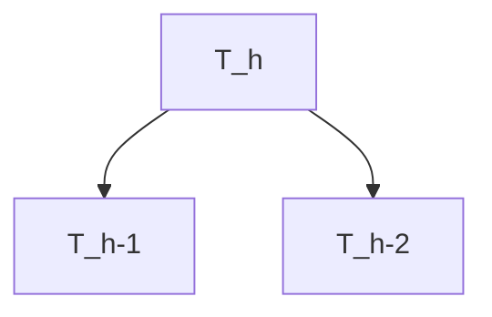

<!--more-->

# 一、图

## 性质

1. 无向完全图边数：$\frac{n(n-1)}{2}$
2. 无向图**度与边**的关系：$TD=2|E|$
3. 有向图：$|E|=ID=OD$
4. 邻接矩阵n次幂：$\mathbf{A}^n_{[i][j]}$ 表示路径长度为 n，i 到 j 的路径的组合数。

## 存储结构

1. 邻接矩阵
   * 有向图
   * 无向图
2. 邻接表
   * 有向图
   * 无向图
3. 十字链表
   * 有向图
4. 邻接多重表
   * 无向图

## 遍历算法

定义：沿着某个顶点出发，通过边，访问图中的所有顶点，且仅访问一次。

核心：从一个顶点出发，可能沿着某条路径搜索又回到该顶点·，为了确保每个顶点只访问一次，所以需要辅助数组 visited[] 标记结点是否已访问过。

1. 深度优先（DSF）

   > 是一个递归（回溯）算法，可以判断图是否有环

2. 广度优先（BSF）

   > 是一个迭代算法，利用队列先进先出来实现广度（深度）优先的遍历，注意节点应该在入队时进行访问，因为节点出队时候需要让邻居节点入队，为了使邻居不重复，要进行是否访问过判断。
   >
   > 如果出队时再进行访问，当上一层两个不同节点有一个相同的邻居，那么这个邻居会按照上一层节点访问按顺序入队两次
   >
   > 已经入队的节点还未被访问，有再次被重复访问的风险。

## 特殊的图

1. 稀疏图

   > 采用 **邻接表** 存储较好

2. 稠密

   > 采用 **邻接矩阵** 存储较好

## 应用

### 最小生成树

算法利用的**关键性质**：设 $G=(V,E)$ 带权连通无向图，$U\in V$，若 $(u,v)$ 是一条权值最小的边，其中 $u\in U,v\in V-U$ 则必存在一颗包含 $(u,v)$ 的最小生成树

1. Prim 算法（加点）
2. Kruskal 算法（加边、并查集）
3. DFS 深度优先

### 最短路径

算法利用的**关键性质**：两点之间的最短路径也包含了路径上其他顶点间的最短路径

1. $Dijkstra$ 算法（类似Prim 加点、更新距离）
2. $Floyd$ 算法
3. $BFS$ 广度优先

### 拓扑排序  

$\text{TopologicSort}$

性质：

若有向图的邻接矩阵为**三角矩阵**，则该图**一定**有拓扑序列

对象：有向无环图（**AOV**）

求解：

1. 常规：

   1. 寻入度为0的顶点
   2. 删其出边
   3. 重复1、2，直到网空或不存在入度为0的点（必有环）

2. DFS：

   利用 DFS **祖先顶点最后退栈的特性**

   如果在退栈时输出，会是逆拓扑序列

### 关键路径

对象：带权有向无环图（**AOE** 网）

意义：求完成整个工程至少需要多长时间（最耗时的路径）

一些概念：

1. 关键活动：不能拖延的活动（最晚开始=最早开始）
2. 关键路径：工程中，最长（最耗时）的路径（关键路径上的都是关键活动）
3. 时间余量：$l-e$ 普通活动可以拖延的时间

几个参量：

1. $v_e$ （**事件**最早**发生**时间）

2. $v_l$ （事件最晚发生时间）

3. $e$ （**活动**早**开始**时间）

4. $l$（活动最晚开始时间）

   

求法：

1. 拓扑排序求出 $v_e$每个事件的最早发生时间（两点之间最长路径）

   > 源点和汇点不能拖延，$v_e=v_l$

2. 逆拓扑排序求 $v_l$ 出每个事件最晚开 始时间（点到汇点的最晚发生时间减去路径长度，最小的，若大于这个时间说明汇点会被拖延）

3. 求 $l$ （活动最早开始时间）

   > 等于引出这个活动的点的最早发生时间

4. 求 $e$ （活动最晚开始时间）

   > 等于活动汇入点的最晚发生时间减去活动耗时。

# 二、树

## 性质

1. 二叉树**度0结点与度2结点**关系： $n_0=n_2+1$
2. 树的**顶点与边**的关系：$n=|E|+1$
3. m 叉哈夫曼树的**分支结点**数 $\frac{(n_0-1)}{(m-1)}$
4. 二叉哈夫曼**非叶**结点数 $n_0-1$
5. 二叉哈夫曼**结点总数** $2n_0-1$
6. 树转二叉树，**右指针为空**的结点数 $n_{(非叶)}+1$
7. 有 n 个结点的二叉树**已知前序序列**，求可能的二叉树个数（等价于以 n 个不同元素进栈，不同的出栈序列个数）$\frac{1}{n+1}C_{2n}^{n}$
8. 二叉哈夫曼树的 **WPL(带权路径长度)** 等于 **所有非叶权值的总和**

1. 二叉树

   * 满二叉树

   * 完全二叉树

     * 堆（Heap）

   * 二叉排序树

     > BST，构建一颗BST，可以使查找、删除效率为 $O(\log_2n)$

   * 平衡二叉树

     > AVT，被优化的二叉排序树

2. 树

   * 双亲表示法

   * 孩子表示法

   * 孩子兄弟表示法

     > 双链表结构

## 二叉树的非递归遍历

### 先序非递归

循环：

1. 一直向左遍历左子，直到左子为空。（在这个过程中，同时访问当前节点，并压栈）
2. 遍历指针转向到栈顶（当前层次）的右子，并且弹栈（当前层的根，在步骤1，第一次遇到时，已经访问完成）。（返回步骤1）

### 中序非递归

循环：

1. 一直向左遍历左子树，直到左子树空。（遍历过程中，不断压栈，记录了访问路径）

2. 访问栈顶（第二次遇见时访问的）（左子空，说明是时候访问该节点），弹栈（说明当前层访问完了，理应弹出），遍历指针指向当前层次的右子。（返回步骤1）

   > 因为当前根节点被弹出，所以如果当转向的右子树为空，会返回到上一层的根节点，此时上一层根节点的左子已经访问完成，转向右子。刚好遍历指针被赋值为右子，而右子是空，表明上一个层次的左子空，所以分支又会回到2，执行右转。

### 后序非递归

循环：

1. 一直遍历左子树，直到左子树为空。（遍历过程中，不断压栈，记录根遍历路径）

2. 看当前层的根是否存在右子，且未被访问过

   * 如果是，说明，右子还未遍历。则遍历指针右转

   * 如果不是，则说明，左子、右子已经结束，应该访问根节点。弹栈弹出当前层的根并访问，并标记此根已访问（标志右子完成）

     > 不要忘记将当前的遍历指针置NULL，再返回上一层时，他标志着，上一层的左子已经遍历完毕。

   

## 树、森林的遍历

1. 树的**先根序列**对应其二叉树的**先序序列**

2. 树的**后根序列**对应其二叉树的**中序序列**

3. 森林的**先序序列**对应其二叉树的**先序序列**

4. 森林的**中序序列**对应其二叉树的**中序序列**

   > 称中序遍历是相对其二叉树而言的，也叫后序遍历，因为根确实是最后访问的

# 三、Catalan 数

## 计算

$$
C_n={2n \choose n }-{2n \choose n-1}=\frac{1}{n+1}{2n \choose n}
$$

## 意义

1. n个不同元素进栈（栈无限容量），有多少个合法的出栈序列

   > 计算总的：不考虑合法性，n进n出，总共2n步，2n步里面选n步出栈，共${2n \choose n}$ 种方案。
   >
   > 计算非法：非法组合（是在总组合里面）等价于对称 y=-1 ，折射后终点在 (2n,-2)，即最后多出栈两次的无条件组合，即 $2n\choose n-1$ 
   >
   > 合法的：总的-非法

2. n个结点的二叉树，有多少种

   > 先序遍历和中序遍历类似，即给定n个不同的元素进站，出栈顺序有 $C_n$ 种

# 四、查找

## 结构

查找表：

1. 静态查找表
2. 动态查找表

查找法：

1. 顺序查找（线性查找）

2. 分块查找（索引查找）

   > n 个元素线性表，均匀分 b 块，每块 s 个元素（索引表、块内都采用顺序查找）
   > $$
   > \begin{aligned}
   > ASL&=L_1+L_2\\
   > &=\frac{b+1}{2}+\frac{s+1}{2}\\
   > &=\frac{s^2+2s+n}{2s}
   > \end{aligned}
   > $$
   > $f’(s)=\frac{1}{2}-\frac{n}{2s^2}$ 当 $s=\sqrt{n}$ 时，ASL 最小，$ASL_{min}=\sqrt{n}+1$

3. 折半查找

   适用：**有序**的**顺序表**

   效率分析：构造判定树

4. 树形查找

   * 二叉搜索树 （BST）
   * 平衡二叉树（AVT）
   * 红黑树
   * B-树
   * B+树

评价指标：

平均查找长度
$$
ASL=\sum_{i=1}^{n}P_iC_i
$$

## 折半查找

**判定树**特性：

1. $\text{mid}=\lfloor \frac{low+high}{2} \rfloor$

   右子树节点数-左子树节点数=0、1

2. $\text{mid}=\lceil\frac{low+high}{2} \rceil$

   左子树节点数-右子树节点数=0、1

3. 一定是**平衡二叉树**

4. 只有最下层是不满的

5. n 个成功结点、n+1 失败结点（空链域）

## 树形查找

### 二叉搜索树（BST）

1. 查找

   遍历 BST 进行比较，在树均衡的情况下查找效率达到 $O(\log_2n)$

2. 构建

   本质是查找过程，在数据本来有序情况下，退化成单边树（链表）

3. 插入

   插入本质是查找过程

4. 删除

   * 叶子结点：直接删除
   
   * 只有左子或右子的结点：**直接**让左子或右子**代替**它就行了

   * 即有左子又有右子：找**左子中最大者（或右子最小者）**代替删除结点，然后在该左子最大（右子最小）结点**原来位置处删除**它
   
     > 最终于会转换为前两种情况
   
   效率：（1）均衡情况下 $O(\log_2n)$（2）最坏情况退化成链表，$O(n)$

### 平衡二叉树（AVL）

named after **Adelson Velsky** and **Landis**

#### 性质

前提：本身是一颗二叉搜索树

解决问题：解决了一般 BST 在极端情况下，退化成链表的情况

特性：引入了平衡因子（左子高-右子高），|（左子树高度-右子树高度）|≤ 1

高度为 $h$ 的 AVL 树**结点最少**的情况：$n_h=n_{h-2}+n_{h-1}+1$ （显然 $n_0=0,\quad n_1=1,\quad n_2=2$）

#### 结点失衡

失衡情况

1. LL型

   冲突的原因：加入结点在失衡结点的**左孩子**的**左子树**上

   特征：失衡结点平衡因子=2，左孩子的平衡因子=1

   解决：失横结点**直接右旋**

2. RR型

   冲突的原因：加入结点在失衡结点的**右孩子**的**右子树**上

   特征：失衡结点平衡因子=-2，左孩子的平衡因子=-1

   解决：失横结点**直接左旋**

3. LR型

   冲突的原因：加入结点在失衡结点的**左孩子**的**右子树**上

   特征：失衡结点平衡因子=2，左孩子的平衡因子=-1

   解决：先**左孩子左旋**，转换成 LL型，再失将衡节点**右旋**

4. RL型

   冲突的原因：加入结点在失衡结点的**右孩子**的**左子树**上

   特征：失衡结点平衡因子=-2，左孩子的平衡因子=1

   解决：先**右孩子右旋**，转换成 LL型，再失将衡节点**左旋**

1. 左旋

   左孩冲突变右孩

2. 右旋

   右孩冲突变左孩

### 红黑树（Red-Black Tree）

#### 性质

1. 是一颗二叉搜索树（**左根右**）

2. 根和叶子结点是黑色（**根叶黑**）

   注意：这里的叶子是补全的**NULL结点**

3. 不能出现连续的红色结点（**不红红**）

4. 任意结点到叶子结点的所有路径上的黑色结点数目相同（**黑路同**）

5. 最长路径不超过**最短路径的2倍**

#### 插入策略

插入的结点默认设置成**红色的**。（应为插入红色相比于黑色，对红黑树影响较小一点）

插入之后，红黑树的性质被破坏，分**三种情况**进行调整：

1. 插入的是根结点

   > 直接变黑

2. 插入结点的叔叔结点是红色

   > 对插入结点上层的结点，红变黑，黑变红，将爷爷结点看做插入结点，继续判断

3. 插入结点的叔叔结点是黑色

   > 根据（LL、LR、RR、RL）进行旋转操作，然后变色

#### 删除情况

与二叉搜索树的删除略同，删除后判定是否违反红黑树性质，若是，则调整

1. 只有左或者右子树情况，直接将代替后的**孩子变黑**

   * 黑红左
   * 黑红右

2. 叶子结点

   * 红（直接删除就行了，不会破坏**黑路同**）
   
   * 黑（最复杂，删除后变成**双黑结点**）
   
     > 引入双黑表示，经过它的路径都少了一个黑结点，调整就是**消除双黑**的过程
   
   

##### 删除的叶子结点是黑色

1. 兄弟是黑色

   * 兄弟孩子至少有一个红色：根据（LL、LR、RR、RL) 先变色，后旋转，双黑变单黑

     > 变色规则：
     >
     > 1. LL、RR型（red 变 sibling，sibling 变 parent，parent 变黑）
     > 2. LR、RL型（r 变 p，p 变黑）

   * 兄弟孩子全黑：兄弟变红，双黑上移（继续调整），若遇**红或根**变单黑（调整结束）

2. 兄弟是红色

   > 兄父变色，朝双黑旋转（保持双黑，继续调整）

### B-树（多路平衡搜索树）

硬盘特性：读取**物理地址连续的多个字节**操作，和**读取单个字节**的操作耗时是几乎无区别

性质：

1. 访问结点是在**硬盘中**进行，结点内的操作是在**内存中**进行的

2. **平衡**（所以叶子节点在同一层）

3. **有序**（结点内部有序，左子、根、右子有序）

4. **多路**

   > m 阶 B树：
   >
   > 最多：m个分支，m-1 个元素
   >
   > 最少：根结点: 2个分子、1个元素
   >
   > ​	：其他结点最少 $\lceil\frac{m}{2}\rceil$ 个分支、$\lceil\frac{m}{2}\rceil-1$ 个元素（考虑失败结点）

#### 插入策略

插入过程：（插入的过程可能导致**上溢出**）

（1）查找到待插入的位置（必定落到叶子结点）

（2）判定是否产生上溢

​	产生溢出后，做调整（中间元素 $\lceil\frac{m}{2}\rceil$ 上移，两边分裂），如果有连锁反应，则继续调整

#### 删除策略

删除过程：（删除过程可能导致**下溢出**（注意考虑失败结点），需调整）

（1）类似二叉搜索树，删除**非叶**结点，转化为删除他的 **直接前驱或后继** 问题

（2）删除**叶结点** 

​	无溢出，则直接删除

​	下溢出，兄弟是否够借？

​		够借，父下来，兄上去

​		不够，合并

### B+树

背景：使用 B-树 遍历所有元素太麻烦。

特性：

1. 叶结点层包含所有的元素（且有序，结点间有指针）
2. 非叶节点部分相当于叶结点层的**索引**（多级索引结构）（一个元素对应一个子树 m=m）
3. B+ 树兼顾了**顺序查找**（链表）、**随机查找**（多级索引）和**范围查找**（先随机找范围内第一个，然后顺序）

## 散列查找

散列函数：

1. 直接定地址法
2. 除留余数法
3. 数字分析法
4. 平方取中法

冲突处理：

1. 开放定址法（$\text{Opening Addressing}$）
   $$
   H_i=(H(key)+d_i) \bmod m
   $$

   * 线性探测法（$\text{Linear Probing}$）

     增量序列：$1,2,3,4,\cdots,m-1$

   * 平方探测法（$\text{Quadratic Probing}$）

     增量 $d_i$ 取：$1,-1,2^2,-2^2,\cdots,k^2,-k^2(k\le\frac{m}{2})$ 

     条件：表长 $m=4j+3$，才能将表全部探测完

   * 伪随机序列探测法

     增量取：伪随机数序列

   * 再散列法 

2. 拉链法（$\text{Chaining}$）

# 五、排序

## 分类

1. 插入排序

   （1）直接插入排序：将无序的子序列插入到有序的子序列，**顺序查找**插入的位置

   （2）折半插入排序：**折半查找**插入的位置

   （3）希尔排序：**增量缩小**，组内采用插入排序

2. 比较排序

   （1）冒泡排序：每趟**通过冒泡的方式**归位一个最大或最小的元素

   （2）快速排序：每趟**选择枢轴**，归位枢轴后，递归处理子序列

3. 选择排序

   （1）简单选择排序：每趟**简单选择**一个最大的元素，将其归位

   （2）堆排序：用**堆结构**来实现选择

4. 归并排序（$\text{Merge Sort}$）：基于 **Merge** 操作的排序

   （1）自顶向下（递归）

   （2）自底向上（非递归）

5.  基数排序（$\text{Radix Sort}$）：不基于比较的排序

## 堆排序

是一种选择排序，利用最大二叉堆的性质，每趟选择最大的元素归位。

二叉堆是一个**完全二叉树**，可以用**顺序表**一一映射。

堆排序的步骤：

（1）建堆 $O(n)$

从**最后一个非叶节点**开始依次**向下调整**

（2）排序 $O(n\log_2n)$

每轮堆顶换到最后（**归位**），然后**向下调整**

堆排序是一种不稳定的选择排序

## 基数排序

流程：

最低位入桶，顺序拿出

再入桶，再拿出

## 结论

（1）基于比较的排序，至少（确保排序成功）需要进行的两两关键字之间的比较次数
$$
\lceil \log_{2}n!\rceil
$$
