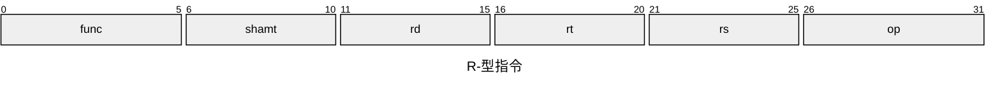
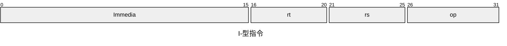
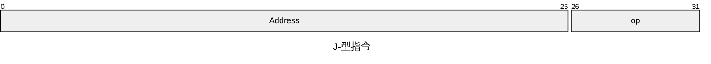

# 指令集架构

## x86-64(IA-32)

## ARM

Advanced  RISC Machines

## RISC-V

Reduced Instruction Set Computer

## MIPS

Microprocessor without Interlocked Pipeline Stages

有32个通用寄存器：（都是软件约定）

zero：恒为0

at：汇编器临时寄存器

v0~v1：返回值寄存器

a0~a3：参数寄存器

t0~t7：临时寄存器

s0~s7

t8~t9

k0~k1

gp：全局指针

sp：栈指针

s8

ra：返回地址

有三种指令格式：

1）R-型指令：为RR型指令；操作码为”000000“；寻址类型为寄存器寻址；支持双目运算，移位运算

2）I-型指令：为立即数型指令；寻址类型有四种，立即数寻址、寄存器寻址、相对寻址、基址/变址寻址；支持双目运算，Load/Store指令，条件分支指令

3）J-型指令：为无条件跳转指令；EA= “PC高四位” + ”Address“ + ”00“

