# 1 物理层

## 1.1 通信基础

- 信息（Information）：定义不统一，极其复杂，
- 信息熵（Entropy）：1948年，香农从热力学引入Entropy，不确定性的度量，常用单位有比特，Nat，Hart
- 消息（Message）：消息中包含信息，是信息的载体，有语义性，是具体的、非物理的
- 数据（Data）：指传送信息的实体，消息编码为数据，仅作为传输手段
- 信号（Signal）：是数据的电气或电磁表现形式，是数据在传输过程中的存在形式
- 码元（Symbol）：指固定时间长度内的信号，码元可以有N个离散状态


## 1.2 信道的极限容量

**Nyquist's first law**

对于理想低通信道，其最大调制速率
$$
B=2W
$$
单位为 Baud，超过此波特率，会发生码间串扰（ISI）


**Channo Limit**

对于带宽受限且具有高斯噪声干扰的信道，其最大数据传输速率
$$
W\log_2(1+\frac{S}{N})
$$
在这种信道上，不超过香农极限传输数据，可以找到某种方法实现无差错的传输

信噪比（dB）$=10\log_{10}(\frac{S}{N})$


## 1.3 编码与调制

编码（Encoding）：

- NRZ
- RZ
- NRZI
- 曼彻斯特编码
- 差分曼彻斯特编码

调制（Modulation）：

- AM
- FM
- PM
- DPSK（差分相移键控）
- QAM


# 2 数据链路层


## 2.1 三个基本问题

* 封装成帧（组帧）
* 透明传输（透明）
* 差错检测（差错检测）


## 2.2 组帧、透明传输

**字符计数**：首部由Flag、计数字段组成

**字节填充（Byte stuffing）**：

当 PPP 协议进行异步传输时，传输单位是字节，采用字节填充

🧠原理：

(1) 把信息字段中出现的每一个 Flag 字节（0x7E） 转变成两字节序列（0x7D 0x5E）

(2) 若信息字段中出现了一个转义字符（0x7D），则转变成 0x7D 0x5D

(3) 若信息字段中出现了ASCII 码控制字符，例如 0x03，则转变为 0x7D 0x23

**零比特填充（Bit stuffing）**：

当 PPP 协议用在 SONET/SDH 链路时，是高速同步传输，传输单位是 bit ，故采用零比特填充

🧠原理：发送端扫描信息字段，发现有5个连续的1，立即填充一个0；接收端识别到连续5个1的 bit pattern 自动删除后面一个0，不会误删原始数据

💡 SONET/SDH 是高速同步光纤链路，SONET 是美标，SDH 是国标

**违规编码法**：

如曼彻斯特编码，电平跳变表示数据，还有1到1，0到0的编码未使用（违规码），故可以使用这些违规码


## 2.3 差错控制

Error Control 有两种解决方式：

- ARQ（Automatic Repeat reQuest）
- FEC（Forward Error Correction）

目前，有线信道质量较好，误码率低，为了减少成本，提高效率，通常采用**检错编码**，即出错的帧直接丢弃，由发送方重传

然而，无线信道，误码率高，一般采用**纠错编码**，接收方进行纠错

- 检错编码
  - 奇偶校验码
  - CRC

- 纠错编码
  - 海明编码


## 2.4 流量控制

Flow Control 总是与可靠传输一起讨论

数据链路层的流量控制，是相邻节点之间的流量控制

基于两种原理：

- 停止-等待（Stop-Wait）
- 滑动窗口

有3种协议实现：

- 停止-等待协议（Stop-Wait）
- 多帧滑动回退N帧协议（GBN）
- 多帧滑动选择重发（Selective Repeat）


## 2.5 点对点信道

### 2.5.1 HDLC

全称 **High-Level Data Link Control**

它是一种经典的 **数据链路层通信协议**，用于在点对点或或对多点的不可靠物理链路上进行**可靠**的数据传输。

**历史沿革**：

- 1970年初，IBM 推出SDLC，是HDLC的前身
- 1976年，ISO采纳标准化为HDLC
- 1980年代，HDLC成为数据链路层的标准协议之一

**特点**：

- 面向比特（传输比特流）
- 支持点到多点（Original）、点到点
- 可靠传输（检错机制、序号机制、确认机制、重传机制、流量控制）
- 流量控制
- 透明传输（比特填充）：发送端检测到连续5个1后，自动加0

**三种模式**：

- `Normal Response Mode`：主从模式
- `Asynchronous Balanced Mode`：对等通信模式（点对点，现在通常用这种模式）
- `Asynchronous Response Mode`：点对多点

**三种帧类型**：

- I帧（Information）：用于传输数据，并提供确认功能
- S帧（Supervisory）：用于流量控制，和对I帧的确认，完成四种功能
- U帧（Unnumberd）：用于链路控制，（如建立、断开、重置等）

**帧格式**：

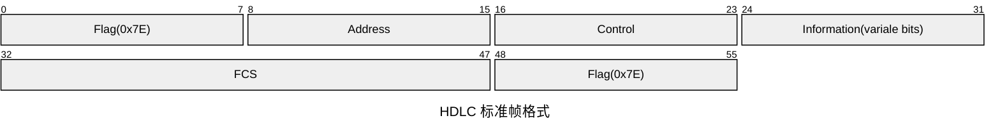

- `Address`：在 **Multipoint** 环境中标识从机；在点对点环境中，置为 0xFF（在多点环境中，也可表示广播）
- `Control`：I 帧、S 帧、U 帧的控制字段格式各不同
  - N（S）：发送序号
  - N（R）：接收序号
  - P/F：Polling or Final

**🧩I 帧 Control 字段结构**

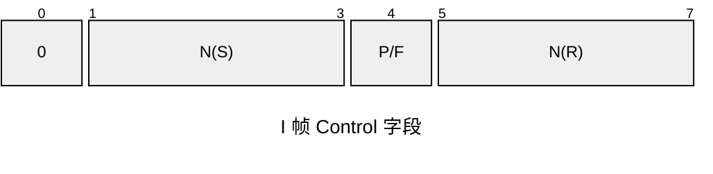

**🧩S 帧 Control 字段结构**

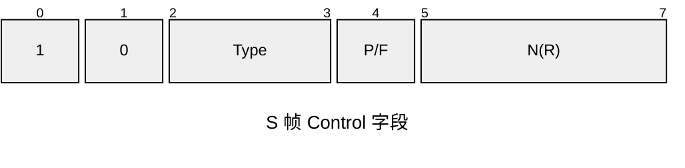

| Type 位 | 名称 | 全称              | 功能                                        |
| ------- | ---- | ----------------- | ------------------------------------------- |
| `00`    | RR   | Receive Ready     | 已准备好接收数据，同时确认收到之前的帧      |
| `01`    | RNR  | Receive Not Ready | 暂时无法接收数据，但仍确认已收到的帧        |
| `10`    | REJ  | Reject            | 否认，从 N(R) 指定的帧开始重传（Go-Back-N） |
| `11`    | SREJ | Selective Reject  | 请求重传某一特定帧（选择重传）              |

**🧩U 帧 Control 字段结构**

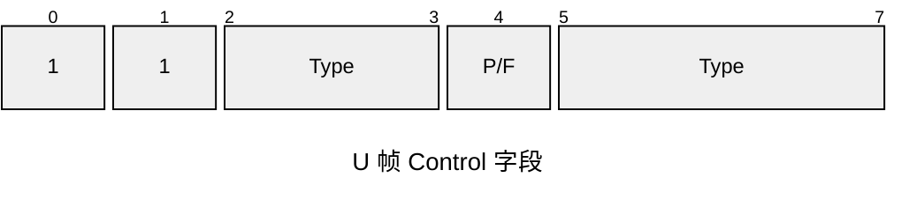

U 帧功能类型：

- SABM
- SABME
- DISC：断开链路
- UA：对 SABM、DISC 等进行确认
- DM
- FRMR：帧格式错误
- UI
- XID
- TEST


### 2.5.2 PPP

全称 **Point-to-Point Protocol**

它也是一种**数据链路层协议**，但比 HDLC 更“现代化”、更通用，主要用于**两端设备之间的直接通信链路**。

**特点**：

- 支持多种网络层协议
- 支持多种类型链路
- 差错检测
- 检测连接状态
- 最大传送单元
- 网络层地址协商
- 提供连接认证
- 数据压缩协商
- 数据加密协商
- 不可靠

**组成**：

1. 一个将 IP 数据报封装到串行链路的方法
2. 一个用来建立、配置和测试数据链路连接的链路控制协议 LCP
3. 一套网络控制协议 NCP

**帧格式**：

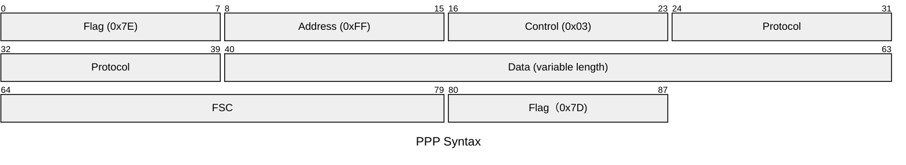

- `Address`：默认 0xFF 表示广播，点对点信道不需要MAC地址，保留地址字段为了兼容
- `Control`：默认 0x03 表示无需帧编号，为了兼容HDLC保留

**透明传输实现：**

- 字节填充（异步传输时）
- 零比特填充（同步传输时）

**用户认证：**

- PAP（明文传输）
- CHAP（三次握手，哈希加密）

**链路空闲：**

连续发送 Flag（0x7E）


## 2.6 广播信道

广播：是一种网络架构，其中发送的分组，可以被网络中的其他的节点接收到


### 2.6.1 共享传输媒体

1. 静态划分信道

   - TDM
   - FDM
   - WDM
   - CDM

2. 动态媒体接入控制（多点接入 MA）

   * 随机接入

     用户随机地发送消息，会产生碰撞

   * 受控接入

     用户不能随机发送消息


### 2.6.2 信道划分介质访问控制

（1）时分多址（TDMA）

（2）频分多址（FDMA）

（3）波分多址（WDMA）

（4）码分多址（CDMA）

原理：将每个比特时间再划分为m个短槽，称为m位码片（Chip），每个站点被指派一个唯一的码片序列

发送1时，发送原码片序列；发送0时，发送相反的码片序列

当有多个站点同时发送信号时，每个站点的码片必须向量两两正交

所有同时发送的码片信号叠加在一起（码片向量线性相加）

收到信号的站点的分用器用发送方的原码片向量，乘以叠加的信号（根据线性叠加原理、分配律、正交性质）将其分出来

规格化正交

不同站点间的码片正交
$$
S\cdot T=\frac{1}{m}\sum_{i=1}^m S_i \cdot T_i=0
$$
码片与自身的规格化内积为1
$$
S\cdot S=\frac{1}{m}\sum_{i=1}^m S_i^2=1
$$
码片与反码片的规格化内积为-1
$$
S\cdot \bar S =-\frac{1}{m}\sum S_i^2 =-1
$$


### 2.6.3 随机访问介质访问控制

**1. ALOHA 协议**

（1）纯 ALOHA（Pure ALOHA）


（2）时隙 ALOHA（Slotted ALOHA） 


**2. CSMA 协议**

（1）1-坚持CSMA

（2）非坚持CSMA

（3）p-坚持CSMA


**3. CSMA/CD 协议**

Carrier-Sense Multiple Access with Collision Detection 载波监听多路访问/碰撞检测，是一种传输介质访问控制（MAC）方法。

共享总线结构存在问题：多个节点使用同一个传输介质**同时**进行发送，信号会产生碰撞

解决办法：监听总线，如果检测到碰撞，则执行退避算法


**🧠争用期的计算：**

监听窗口大小，应往最坏情况考虑（即最网络上物理最远的两个端点A、B发生冲突）

B在A的信号即将到来之前发送，则A需要一个RTT的时间，才能检测到碰撞，最远点之间的RTT就是争用窗口


**🧠最小帧长：**

争用期保证了一件事：如果发生冲突，一定在发送完成前被检测到

碰撞在最坏情况下，需要经过 $2\tau$ 时间才能被检测到

所以数据帧不能在 $2\tau$ 时间内，就被传送完毕

以此产生了**最小帧长**：争用期x数据传送率

以经典 10 Mbps 以太网为例，争用期=51.2 us，则 MTU = 64 B 


**🧠截断二进制指数退避算法**：

1. 协议规定了基本争用时间为 $2\tau$，具体时间是 51.2 us（10 Mbps 网络）

2. 从离散整数集合 $[0,1,\cdots,2^k-1]$，随机取出一个数记为 r，重传应推后的时间就是争用期的 r 倍
   $$
   k=\min\{重传次数,10\}
   $$

3. 当重传次数达16次仍不能成功时，则丢弃该帧，并向高层报告


**4. CSMA/CA 协议**

CA算法：

检测到空闲后，若为首次发送（非重传），则维持一段DIFS后，发送数据帧，冲突也不中断

若非，执行退避算法，计算退避（Backoff）时间

以退避时间为倒计时，继续检测，检测到繁忙倒计时暂停，倒计时为0后发送完整数据帧

收到确认帧后，发送完毕


退避算法：

离散整数集合：$[0,1,\cdots,2^{2+k}-1]$
$$
k=\min\{重传次数，6\}
$$


信道预约：

1. 检测到空闲后，等待一个DIFS，源站向AP发送一个RTS
2. 若AP接收到正确的RTS，则信道空闲，等待SIFS后，广播一个CTS
3. 源站收到CTS后，等待一个SIFS，发送数据
4. 若AP正确收到数据后，等待一个SIFS，发送ACK


**🚀 介质访问控制 ⚔️ 总线仲裁 **

MAC 是对网络信道（网线的）争用；而总线仲裁指的是芯片内的 Masters 对共享总线的争用

MAC 是允许冲突产生；总线仲裁不允许冲突产生

MAC 是用分布式协议解决冲突；芯片内集中式仲裁则避免了冲突


## 2.7 扩展的以太网


### 2.7.1 转发器

**Repeater**

- 工作在物理层

- 同一冲突域
- 直接转发，没有存储转发


### 2.7.2 集线器

**Hub** 

- 工作在物理层，将多条以太网双绞线或者光纤集合连接在同一段物理介质下

- 连接的设备都处于同一网段下，同一冲突域

- 用电子器件模拟实际电缆工作，从逻辑上还是总线结构

- 半双工的通信方式采用CSMA/CD的冲突检测方法

- 每一个数据包都被发送到集线器的每一个端口（除输入端口）


### 2.7.3 网桥

**Network Bridge**，工作在 OSI 第二层（数据链路层），有内部数据库，划分碰撞域（Collision Domain）


**特点：**

- 网桥能够识别数据链路层中的数据帧，并将这些数据帧临时存储于内存，再重新生成信号作为一个全新的数据帧转发给相连的另一个网段（network segment）。由于能够对数据帧拆包、暂存、重新打包（称为存储转发机制 store-and-forward），网桥能够连接不同技术参数传输速率的数据链路，如连接10BASE-T与100BASE-TX。
- 数据帧中有一个位叫做FCS，用来通过CRC方式校验数据帧中的位。网桥可以检查FCS，将那些损坏的数据帧丢弃。
- 网桥在向其他网段转发数据帧时会做冲突检测控制。
- 网桥还能通过地址**自学机制**和**过滤功能**控制网络的流量，具有OSI第2层网络交换机功能。这称为transparent bridge，由 DEC在1980年代发明。其机制是网桥内部有一个数据库，最初没有数据。当网桥从一个网段收到一个数据帧，就会在数据库中登记（或者更新）数据帧的源地址属于这个网段，并检查数据包的目的地址。如果目的地址在数据库中属于另外一个网段，则网桥向该网段转发该数据帧；如果目的地址在数据库中没有记录，则网桥向除了源地址所在之外的其他所有网段转发（flood）该数据帧。
- 桥接器仅仅在不同网络之间有数据传输的时候才将数据转发到其他网络，不是像集线器那样对所有数据都进行广播。对于以太网，“桥接”这一术语正式的含义是指符合IEEE 802.1D标准的设备，即“网络切换”。桥接器可以分割网段，不似集线器仍是在为同一碰撞域，所以对带宽耗损较小。因桥接器透过其内之MAC表格，让发送帧不会通过，所以其称之为数据链接层操作之网络组件，可隔离碰撞。


### 2.7.4 交换机

**Network Switch**，相当于多端口的网桥（Network Bridge），有内部数据库，提供多端口的二层桥接是以太网交换机的核心功能

（1）特点

1. 独占媒体，无碰撞传输
2. 硬件转发
3. 存储转发

（2）工作方式

当一台交换机安装配置好之后，其工作过程如下：

- 收到某网段（设为A）MAC地址为X的计算机发给MAC地址为Y的计算机的数据包。交换机从而记下了MAC地址X在网段A。这称为学习（learning）。
- 交换机还不知道MAC地址Y在哪个网段上，于是向除了A以外的所有网段转发该数据包。这称为泛洪（flooding）。
- MAC地址Y的计算机收到该数据包，向MAC地址X发出确认包。交换机收到该包后，从而记录下MAC地址Y所在的网段。
- 交换机向MAC地址X转发确认包。这称为转发（forwarding）。
- 交换机收到一个数据包，查表后发现该数据包的来源地址与目的地址属于同一网段。交换机将不处理该数据包。这称为过滤（filtering）。
- 交换机内部的MAC地址-网段查询表的每条记录采用时间戳记录最后一次访问的时间。早于某个阈值（用户可配置）的记录被清除。这称为老化（aging）。


## 2.8 协议

IEEE 802 是指 IEEE 中关于局域网、城域网的一系列标准

每个子标准都由委员会下的一个工作组负责

著名的标准有：

- IEEE 802.1（Bridging and Networking Management）：高层局域网协议
- IEEE 802.2（Logic Link Control）：
- IEEE 802.3（Ethernet）
- IEEE 802.4（Token bus）
- IEEE 802.5（Token-ring）
- IEEE 802.6（MAN）
- IEEE 802.8（FDDI）
- IEEE 802.11（Wireless LAN & Mesh）


### 2.8.1 VLAN（IEEE 802.1Q）

**历史沿革**：最初由Cisco，3Com，HP等网络设备厂商在其产品中引入**端口分组**或**虚拟网络**技术，形成VLAN雏形，各厂商协议不一

之后，由 IEEE 委员会的 802 工作组于1990年代开始制定标准，于1998年正式发表VLAN协议标准

**实现**：通过在标准以太网帧的 `Ether Type` 字段前加入4字节的 VLAN tag，形成802.1Q帧

**目的**：将物理网络划分成多个逻辑子网，形成多个独立的广播域。随着设备的增加，广播风暴会降低网络性能，

不同VLAN之间默认不能通信（安全性）


### 2.8.2 以太网（IEEE 802.3）

**历史沿革**：

1973年，Rober Metcalfe 在 Xerox PARC 发明以太网，灵感来自ALOHA

1979年，Metcalfe 离开Xerox，创办3Com，推动以太网商业化

1980年，Intel、DEC、Xerox联合提出 DIX Ethernet V1 规范，速率为10Mbps，使用粗同轴线缆（10BASE5）

1983年，IEEE正式发布 802.3标准，这是最初的经典以太网

1985年，提出10BASE-2

1990年，出现基于双绞线的10BASE-T


目前最常用的是DIX Ethernet Ⅱ标准，IEEE 802.3 制定的标准与Ethernet Ⅱ相差无几

**802.3 目前标准：**

- IEEE 802.3（10BASE-T）
- IEEE 802.3u（100BASE-T）
- IEEE 802.3z（1000BASE-LX）
- IEEE 802.3ab（1000BASE-T）
- IEEE 802.3an（10GBASE-T）


**8P8C标准类别**：

- CAT-3：16MHz，10Mbps，十兆以太网
- CAT-4：20MHz，16 Mbps，常用于十六兆令牌环网
- CAT-5：100MHz，100Mbps，常用于百兆以太网，短距离可跑千兆
- CAT-5e：125MHz，1000Mbps，常用于千兆以太网
- CAT-6：250MHz，1000Mbps，可跑万兆，55m有衰减
- CAT-6A：500MHz，10Gbps，常用于万兆以太网
- CAT-7：600MHz，10Gbps，
- CAT-8：2000MHz，40Gbps，


**以太网标准沿革：**

10Mbps以太网：

- 10BASE5：RG-11同轴电缆，最大距离500m，最多100台
- 10BASE2：RG-58同轴电缆，最大距离100m，最多30台，成本低
- StarLAN：第一个双绞线上实现的10Mbps以太网，后发展为10BASE-T
- 10BASE-T：3，4，5类双绞线
- FOIRL：光纤以太网原始版本
- 10BASE-F：10Mbps以太网光纤标准通称

100Mbps以太网（Fast Ethernet 为 IEEE 于1995年发表）：

- 100BASE-T：最远100m
  - 100BASE-TX
  - 100BASE-T4
  - 100BASE-T2
- 100BASE-FX：多模光纤，最远400m（半双工连接），2km（全双工）

1000Mbps以太网：

- 1000BASE-T：超五类线或6类线
- 1000BASE-SX：多模光纤（220m-550m）
- 1000BASE-LX：多模光纤（小于550m）、单模光纤（小于5000m）
- 1000BASE-LX10：单模光纤（小于10km）
- 1000BASE-LHX：单模（10km-40km）
- 1000BASE-ZX：单模（40km-70km）
- 1000BASE-CX：铜缆上达到短距离的方案（小于25m），早于1000BASE-T


**802.3组成**：

- 前导码（Preamble）（7 octets ）（10101010）(0x55 0x55...)
- 帧开始符（SFD）（1 octets ）(10101011)（0xD5）
- 数据帧（64-1522 octets ）
  - destination MAC（6 octets）
  - soure MAC（6 octets）
  - 802.1Q tag（4 octets）（可选的）
  - Ethernet Type（2 octets）
    - `0x0800`：IPv4
    - `0x0806`：ARP
    - `0x8100`：802.1Q帧
    - `0x86DD`：IPv6
  
  - Payload（46-1500 octets）
  - FCS（4 octets）
  
- 帧间间距（IFG or IPG）（12 octets ）(96 bit 时间)

💡注：传输时，LSB First


**DIX Ethernet Ⅱ 标准**：

DIX 全称 **DEX Intel Xerox**，最初由DEX，Intel，Xerox联合统一推行

DIX Ethernet Ⅱ 的格式：


Ether Type 取值：

| 值     | 含义   |
| ------ | ------ |
| 0x0800 | IPV4   |
| 0x0806 | ARP    |
| 0x8100 | 802.1Q |
| 0x86DD | IPv6   |


### 2.8.3 WLAN（IEEE 802.11）

无线局域网，IEEE802.11 工作组于1997年正式发表初代Wi-Fi

设计目的是与以太网无缝互通

**历史沿革**:

- 802.11a（1999年）（5GHz）（54Mbps）(OFDM)：
- 802.11b（1999年）（2.4GHz）（11Mbps）(DSSS)：
- 802.11g（2003年）（2.4GHz）（54Mbps）：
- 802.11n（2009年）（双频段）（600Mbps）（MIMO）（Wi-Fi4）：
- 802.11ac（2013年）（5GHz）（1-7Gbps）（MU-MIMO）（Wi-Fi5）：
- 802.11ax（2019年）（双频段）(9.6Gbps）（OFDMA）（Wi-Fi6）：
- 802.11be（Wi-Fi7）（三频段）（46Gbps）

**几个概念**：

- AP（接入点）
- BSS
- ESS
- SSID
- STA
- Portal

**WLAN的两种组成类型**：

- 有固定基础设施的WLAN（Infastructure Mode）
- 无固定基础设置的自组WLAN

**802.11 MAC帧分类**：

- 数据帧
- 管理帧
- 控制帧

**802.11 MAC帧格式**：

|     Field      | Frame control | Duration, id. | Address 1 | Address 2 | Address 3 | Sequence control | Address 4 | QoS control | HT control | Frame body | Frame check sequence |
| :------------: | ------------- | ------------- | --------- | --------- | --------- | ---------------- | --------- | ----------- | ---------- | ---------- | -------------------- |
| Length (Bytes) | 2             | 2             | 6         | 6         | 6         | 0, or 2          | 6         | 0, or 2     | 0, or 4    | *Variable* | 4                    |

**帧控制字段格式**：

|     Field     | 协议版本 | 类型 | 子类型 | 去往AP | 来自AP | 更多分片 | 重试 | 功率管理 | 更多数据 | WEP  | 顺序 |
| :-----------: | -------- | ---- | ------ | ------ | ------ | -------- | ---- | -------- | -------- | ---- | ---- |
| Length (bits) | 2        | 2    | 4      | 1      | 1      | 1        | 1    | 1        | 1        | 1    | 1    |


## 2.9 MAC 地址

由于是在 MAC 层（数据链路层）使用的地址，所以叫 MAC 地址

 **🧩组成部分：**

- OUI（Organizationally Unique Identifier）：前24位，由 IEEE 管理，分配给厂商
- NIC（Network Interface Controller）：后24位，由厂商自己管理


**⭐关键 bit :**

- I/G：第一字节的最低位；0表示单播（设备地址），1表示组播（不能用于设备地址）
- U/L：第一字节的倒数第二位；0表示全球唯一，1表示本地管理


**🎯 本地管理：**

表示由用户自己生成并管理的合法MAC，全球内可能不唯一

✔I/G位 符合语义

✔不能采用广播地址


**特殊 MAC 地址：**

全0：表示未初始化

全1：广播地址


# 3 网络层


## 3.1 IPv4

IP 数据称作 Datagram，数据分组称为 Fragment

**历史沿革**：

1973年，Vinton Cerf 与 Robert Kahn 提出一个通用网络互联协议的设想——TCP

1978年，由于 TCP 过于复杂，TCP 被拆解为 TCP+IP

1981年，IP 被标准化定义为 RFC 791，即现在IPv4的初始版本

1983年1月1日，ARPANET正式替换为 TCP/IP 网络协议栈

1993年，提出CIDR，RFC 1519

1994年，提出NAT，RFC 1631

1996年，提出三类私有IP不在公网上路由，RFC 1918

1998年，IPv6正式标准化为 RFC 2460

2012年，提出共享地址空间（Shared Address Space），for CGNAT，RFC 6598

**首部格式**：

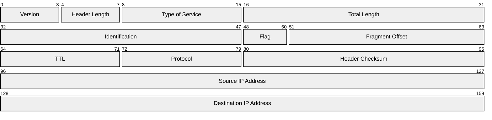

- `Version`：版本号
- `Header Length`：首部长度（单位4B）
- `Type of Service`：
  - 前三位（优先级）
  - `Delay`（延迟位）
  - `Throughput`（吞吐量位）
  - `Reliability`（最高可靠性位）
  - 后两位（保留）
- `Total Length`：首部+数据部分总长度
- `Identification`：标识位，出自同一数据报的分组标识位相同
- `Flag`：
  - 前一位：保留，无意义
  - `DF`：Don't Fragment，1允许分片
  - `MF`：More Fragment，1表示还有分片，0表示没有
  
- `Fragment Offset`：片偏移（单位8B）
- `TTL`：分组能通过的最大路由器数量，路由器转发分组数据前，减1
- `Protocol`：数据部分使用的协议
- `Header Checksum`：首部校验和，路由器每次会校验首部，出错直接丢弃


Protocol 字段取值：

- `ICMP`：1
- `IGMP`：2
- `IP`：4
- `TCP`：6
- `EGP`：8
- `IGP`：9
- `UDP`：17
- `IPv6`：41
- `ESP`：50
- `OSPF`：89


**地址划分**：

- 分类的IP地址（两级结构）（1981年的RFC 791）
- 划分子网（1985年的RFC 950）
- CIDR (Classless Inter-Domain Routing)（无分类编址）（1993年的RFC 1519）

分类的IP地址：

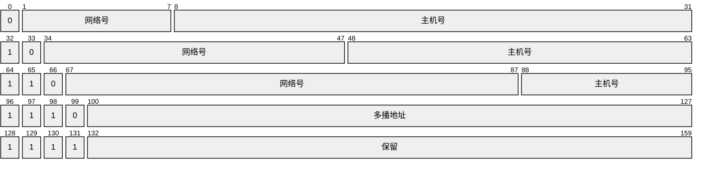

特殊地址：

- `网络号+主机号全0`：表示网络本身，通常在路由表上
- `网络号+主机号全1`：定向广播地址

- `0.X.X.X`：表示本网络的主机
  - `0.0.0.0`：本网络的本主机，主机发起DHCP请求时没有IP号，以此表示源地址；路由表上，表示默认路由；端口绑定，表示监听任意端口
- `127.X.X.X`：回环测试地址
  - `127.0.0.1`：标准回环测试地址
- `255.255.255.255`：本网广播地址（受限）


缓解IPv4地址不足：

鼓励局域网使用私有地址，不在公网上进行路由

- 私有地址（RFC 1918_1996年)

- NAT技术（RFC 1631_1994年)

- 共享地址空间（RFC 6598_2012年）：`100.64.0.0/10`，同于CGNAT (Carrier NAT)


三类私有网络（RFC 1918）：

- 10.0.0.0/8
- 172.16.0.0/12
- 192.168.0.0/16


## 3.2 IPv6

支持：

- 单播（unicast）
- 多播（multicast）：IPv6取消使用广播概念，将其看作时多播的一个特例
- 任播（anycast）：用路由选择算法，交付给距离最近的主机

组成：基本首部+有效载荷

**数据报格式**：(40B)

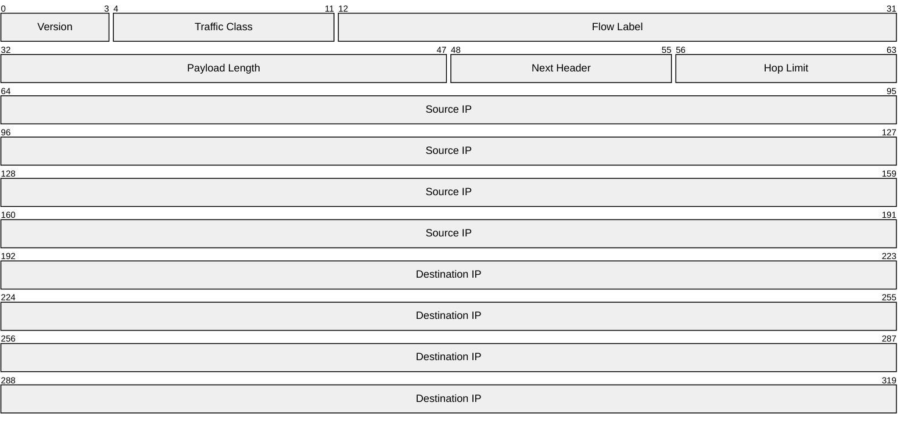

**基本首部字段解析**：

- `Type`：版本 6
- `Traffic Class`：类似于IPv4的ToS
  - DSCP（前6位）
  - ECN（后2位）
- `Flow Label`：流标识符，标识某条数据流
- `Payload Length`：有效载荷长度，最大65535
- `Next Header`：下个首部类型，TCP=6，UDP=17，或扩展首部（如路由扩展头=43，分段扩展头=44）
- `Hop Limit`：跳数限制，等同于TTL，只是叫法不同

DSCP（Differentiated Service Code Point）：

- `CS0`：000000，普通流量
- `CS1-CS7`：00100-111000，优先级队列

ECN（Explicit Congestion Notification）：

- `00`：非ECN支持
- `01`：ECN(1)
- `10`：ECN(0)
- `11`：拥塞已发生-CE


**流（Flow）的概念**：

Flow 是一组具有相同源IP、目的IP、Traffic Class、Flow Label的IPv6数据报


**流的工作机制**：

1. 主机初始化一个流时，给该流分配一个`Flow Label`
2. 后续这个流的所有数据报都带有相同的`Flow Label` 
3. 路由器或交换机，识别`Flow Label`+`源/目的IP`后，为该流建立缓存状态或转发表项，避免每次解析复杂头部
4. 中间节点可以对这个流施加
   - 一致性转发（如同一条MPLS路径）
   - QoS策略
   - 负载均衡策略

**地址**：

- 未指明地址：`::/128`
- 环回地址：`::1/128`
- 多播地址：`FF00/8`
  - 前8位：固定多播标识
  - 后4位：Flag，0表示永久地址
  - 后4位：Scope，作用域，如链路本地=2
  - 余112位：Group ID，如All Nodes=1; All Routers=2
- 本地链路单播地址（link-local unicast）：`FE80::/10`
  - 前10位：固定标识
  - 中54位：全0，预留
  - 后64位：接口标识（IID），可采用EUI-64计算
- 全球单播地址


**从IPv4过渡到IPv6**：

- 双协议栈
- 隧道技术


## 3.3 ARP

**基本特点**：

- 工作在网络层
- 在以太网MAC帧上封装

**两种数据报**：

- ARP 查询（请求）广播
- ARP 响应单播

**ARP数据报格式**：

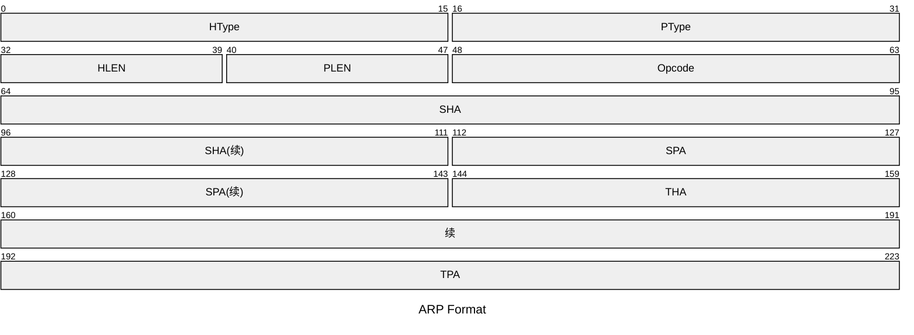

- `HType`：硬件类型，以太网填 0x0001
- `PType`：协议类型，IPv4 填 0x0800，IPv6 填 0x86DD
- `Opcode`：ARP 请求填1，响应填2；RARP 请求填3，响应填4
- `SHA`：Sender Hardware Address
- `THA`：Target Hardware Address

在请求阶段，不知道目的方的 MAC 地址，填 00:00:00:00:00:00 表示


**工作流程**：

1. 查源主机本地的 ARP 缓存表
2. 若有，直接发送；若无，继续下一步
3. 广播 ARP 请求报文
4. 目的主机收到 ARP 请求后，单播 ARP 响应报文
5. 源主机更新 ARP 缓存表
6. 查表，发送


**ARP Spoofing 原理**：

因为

- ARP 协议对 ARP 响应不做认证
- 不存在有请求才响应，响应可以直接发
- 只要有响应，接受到该 ARP 响应的主机就直接覆盖其本地ARP缓存表

所以，攻击者可以通过高频率持续不断地发送伪造的 ARP 响应，保持被害者的 ARP 缓存表一直是脏的


## 3.4 DHCP

于1993年10月制定为标准，前身是 BOOTP

**基本特点**：

- 基于UDP：客户端68，服务器67
- C/S结构


**DHCP工作流程**：**DORA**

1. Discover
2. Offer
3. Request
4. Acknowledge


客户端的报文的源地址：0.0.0.0，目的地址：255.255.255.255


## 3.5 ICMP

一共分两大类：

（1）差错报文

- `3`：终点不可达
  - 网络不可达（code=0）
  - 主机不可达（code=1）
  - 协议不可达：（code=2）
  - 端口不可达：（code=3）
  - 要求分段，却设置DF：（code=4）
  - 源路由失败：（code=5）
- `5`：重定向（改变路由）
  - 重定向网络
  - 重定向主机
  - 基于TOS的网络重定向
  - 基于TOS的主机重定向
- 源点抑制
- `11`：超时
  - TTL超时（0）
  - 分组重组超时（1）
- `12`：参数问题
  - IP报首部参数错误（0）
  - 丢失必要选项（1）
  - 不支持的长度（2）

（2）查询报文

- 回送请求与响应报文
  - `8`：请求
  - `0`：响应
- 时间戳请求与响应报文
  - `13`：请求
  - `14`：响应


报文结构：

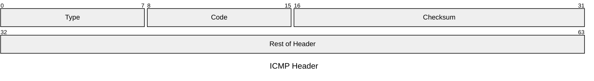

- `Type`：ICMP报文类型
- `Code`：代码，进一步指明子类型
- `Checksum`：校验和
- `Rest of Header`


## 3.6 互联网路由选择协议

路由算法是路由选择协议的核心

路由算法：

- 距离-向量算法
- 链路状态算法

分层的路由选择协议：

- IGP
- EGP


## 3.7 RIP

**历史沿革**：

RIP所用的Bellman-Ford算法，最早被用于计算机网络是在1969年，当时是ARPANET的初始路由算法。


**版本**：

- RIPv1：使用分类路由，定义在《RFC 1058》中。不支持VLSM

- RIPv2：支持Route Tag；携带掩码信息，路由聚合与CIDR

- RIPng


**前置知识点**：

松弛（Relaxation）：

> 对于目的节点，若有一中间节点u，dist[u]+w(u, v) < dist[v]，即通过中间节点达到目的节点，耗费更少，则更新最短路径估计
>
> 中间节点，使最短路径估计dist[v]松弛了，缩小了其距离

python 代码演示：

```python
if dist[u] + w(u, v) < dist [v]:
    dist[v] = dist[u] + w(u, v)
    predecessor[v] = u
```


**特点**：

- 基于 Bellman-Ford 算法

- 是一种距离向量路由算法
- 基于UDP，端口520
- 距离是跳数（Hop count）：最大15，16表示不可达；0表示到直接与路由器相连的网络的距离（计算机网络教材上是1）
- Cisco RIP策略启动了等价负载均衡，标准RIP没有
- 与谁交换？交换的对象是直接相连的路由器（邻居路由）
- 交换什么？广播交换的是整个路由表（路由器的全部信息）
- 何时交换？通常30s，根据Update Timer的值

**缺点**：

- 跳数限制了网络规模

- 坏消息传播慢

- 传递的是整个网络的距离向量，报文太大


**工作原理**：通过邻居的Router Imformation来松弛最短路径估计

若有新网络的路由，则增加一条；

若有旧网络的原路由（端口一致），则更新；

若有旧网络的新路由（端口不一致），则松弛


**4个关键计时器**：

- `Update Timer`：计时30秒，向邻居广播自己的整个路由表（255.255.255.255 in RIPv1; 224.0.0.9 in RIPv2）
- `Invalid Timer`：计时180秒，若某路由表项没收到更新，则使之失效，Hop Count设置为16
- `Flush Timer`：计时240秒，删除所有无效路由表项（所以路由表项失效后，有60s的时间来向邻居传递）
- `Hold-down Timer`：计时180秒，当检测到坏消息后（跳数增加），180s内该表项不接收任何更新（not part of RFC 1058, Cisco's implemention）

**RIP数据报格式**：首部（4B）+一条路由项（20B）

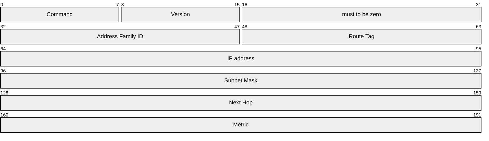

- `Command`：1表示请求；2表示响应；请求常用于路由器启动时
- `Version`：版本号，1表示RIPv1；2表示RIPv2
- `RIP Routing Entry`：（20B）
  - `Address Family ID`：1表示IPv4；全0在请求中表示全部
  - `Route Tag`：仅RIPv2
  - `IP address`：目的网络地址
  - `Subnet Mask`：子网掩码；RIPv1用默认类地址掩码
  - `Next Hop`：sender路由器的接口IP地址，仅RIPv2
  - `Metric`：度量值，Hopcount


**防止环网络，计数到无穷方法**：

- 水平分割（Split Horizon）：RIP从某接口学到的路由信息，不会从该接口再发回邻居设备
- 毒性逆转（Poison Reverse）：RIP从某接口学到的路由信息后，将该路由的开销设置为16，并从原接口返回（给邻居投毒）
- 滞留计时器（Hold down Timer）：检测到坏消息，180s内不接收任何对该路由表项的更新
- 触发更新（Triggered updates）：事件驱动，路由信息一有变化，立即向邻居设备发送触发更新报文


## 3.8 OSPF

采用开销（Cost）作为度量

用LSDB来保存当前网络拓扑结构，一台多区域路由器，为每一个区域维护一份LSDB

将网络划分多个区域，其中骨干区域是核心，所有的非骨干区域于骨干区域直接连接，或者虚链路连接

区域将网络中的路由器逻辑上分组，并以区域为单位向网络的其余部分发送汇总的路由信息

区域是以接口位单位划分的


**历史沿革**：

- 1998年，提出OSPFv2，RFC 2328
- 2008年，提出OSPFv4，RFC 5340，支持IPv6

**基本特点**：

- 网络层协议：直接搭载在IP数据报，IP首部的协议字段是89

- 发送信息采用洪泛法（Flooding）：传播给邻居，邻居再传邻居（但不回传）
- 发送的信息是链路状态（与相邻路由器的链路状态）
- 只有链路状态有变化时（或者一个同步周期），才洪泛信息
- 允许对每条链路，设置不同的代价
- 负载均衡
- 具有鉴别功能
- 支持VLSM与CIDR
- 每个链路状态都带有32位的序号，序号越大，状态越新


**数据报格式**：（24B通用Header）

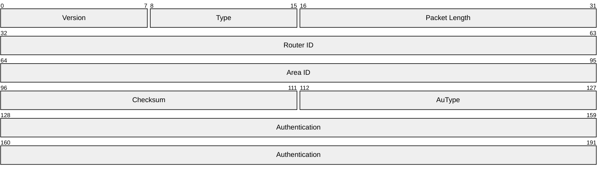

- `Version`：目前有v2，v3
- `Type`：报文类型
  - Hello：用于邻居发现于保持邻居关系
  - DBD：交换LSA摘要
  - LSR：请求某些LSA
  - LSU：搭载LSA
  - LSAck：确认LSA已收到
- `Router ID`：发出报文的路由器ID
- `Area ID`：报文所属OSPF区域ID
- `AuType`：认证类型
  - 无认证
  - 明文
  - MD5
- `Authentication`：根据认证类型决定用途

**Hello 报文格式**：

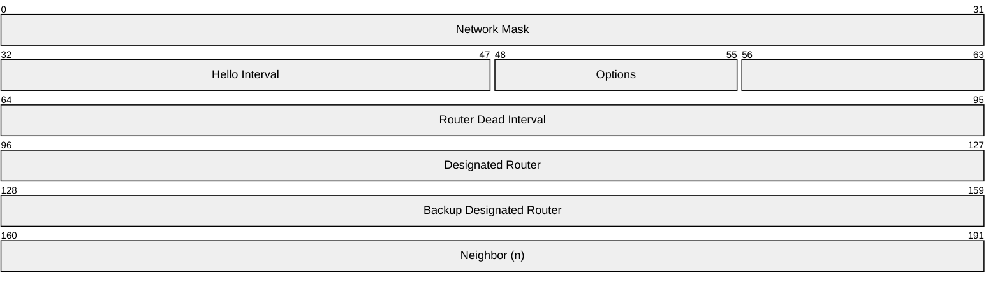

- `Hello Interval`：指定时间间隔，向所有接口发送Hello数据包，收到Hello包的路由器会将对方标识放进自己的Hello包，形成Helloseen包
- `Router Dead Interval`：指定时间间隔内，未收到来自已经建立连接的邻居的Hello包，则将对方状态转为down 

**DBD 报文格式**：

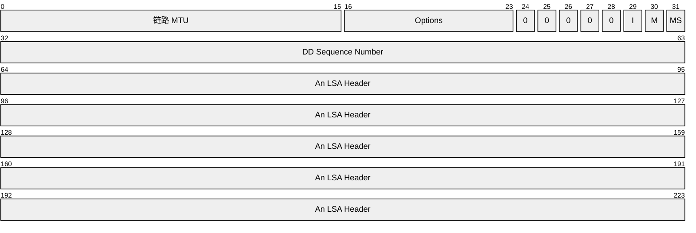

当两个路由器互相收到Hello Seen数据包之后，开始相互发送空DBD数据包，以便确立主从关系（路由ID较大的为Master）

主从关系确定后，从机使用主机的DD序列号发送第一个带有LSA Header的DBD数据包

主机发送确认DBD数据包（主机序列号+1）


**划分区域**：区域编号占32bit，可采用点分十进制表示，也可以采用十进制表示；限制了洪泛范围，每个区域只维护本区域的链路状态

- 骨干区域
- 传送区域
- 末梢区域（Stub Area）
  - 不完全末梢区域（NSSA）
  - 完全末梢区域（Totally SA）
  - 完全非纯末梢区域（Totally NSSA）

**路由器类型**：OSPF定义了4种路由器类型

- 内部路由器
- 骨干路由器
- 区域边界路由器（ABR）
- 自治系统边界路由器（ASBR）

**网络类型**：OSPF定义了4种网络类型

- `点对点网络`：不选举DR与BDR；直接使用224.0.0.5发送
- `广播网络`：需要选举DR与BDR；所有始发于DR以及BDR的OSPF数据报，以224.0.0.5为目的地址，多播发送给其他路由器，其他路由器则以224.0.0.6作为目的地址，多播到DR与BDR
- `非广播多路访问（NBMA）`：需要选举DR与BDR；所有OSPF数据报以单播发送
- `点到多点网络`：不选举DR与BDR；是NBMA网络的特殊设置，可看作是一群点到点链路的集合，使用224.0.0.5发送OSPF数据报

**LSA类型**

LSA 通过 LSU报文进行传递

- Router-LSA：每个OSPF路由器都会产生此LSA，记录了本路由器的接口状态、出站代价，只能在区域内洪泛
- Network-LSA：是由DR为了描述其连接的MA网络，以及与其建立邻接关系的所有路由器产生的，只能在区域内洪泛
- Summary-LSA：描述的是此区域间的网络，用于传播到其他区域，由ABR生成
- ASBR Summary-LSA：由ABR生成，用于区域间转发外部路由
- AS-External-LSA：描述的是AS外部的网络（如BGP），由ASBR生成
- Group-Membership-LSA
- NSSA-External-LSA

**指定路由器与备份指定路由器**：

DR与其他路由器完全邻接（Fully Adjacency），其他路由器之间邻居状态停留在2-Way

DR是路由器上的接口属性

DR完成两项工作：

- 描述该多路访问网络和与其相连接的路由器
- 管理该多路访问网络上的LSA洪泛扩散过程

DR选举规则：

- 接口优先级为0的路由器永远不可能称为DR或BDR
- 最高优先级的路由器选举为DR，次高优先级选举为BDR
- 如果多台路由器优先级相同，那么具有最高路由器ID的路由器成为DR
- DR失效时，BDR成为DR，同时重新选举一个BDR
- 优先级取值范围：0-255
- DR与BDR选举是非抢占式的

**邻接（同步）关系**：

OSPF中两台路由器要建立完全邻接关系，一下参数需要相同：

1. Hello 间隔
2. Dead 间隔
3. 区域编号
4. 认证
5. 链路MTU大小
6. 子网掩码
7. 子网号
8. 末梢区域设置

**建立邻接关系需要经历以下状态**：

1. 失效状态（Down）：表示最近没有从邻居收到信息
2. 尝联状态（Attempt）：表示最近没有从邻居收到信息，这时按一定时间间隔向邻居发送Hello数据包
3. 初始状态（Init）：表示最近收到了从邻居发送来的Hello数据包。但仍未建立双向通信
4. 双向通信（2-Way）：建立了双向通信。只有2-Way状态下的路由器才能参与DR与BDR选举
5. 信息交换状态（ExChange）：具有发送所有OSPF数据报的能力
6. 信息加载状态（Loading）：路由器向邻居发送LSR数据报
7. 完全邻接状态（Fully Adjacency）


## 3.9 BGP

**基本特点**：

- 基于TCP，端口号179
- 是路径向量（Path Vector）路由选择算法
- 寻找一条较好的路由，并非最佳路由
- 非负载均衡


**eBGP与iBGP**：

- AS内的节点是iBGP全连接的
- 从eBGP收到的路由通告，向它的所有BGP对等端发布

- 从iBGP收到的路由通告，不再向它的iBGP对等端发布
- 从iBGP收到的路由通告，可以向它的eBGP对等端发布，视具体同步情况


**路由**：

路由格式：<网络前缀，BGP路由属性>

最重要的路由属性包括：

- AS-PATH
- NEXT HOP


**路由选择策略**：

1. 本地偏好值（LOCAL-PREFerence）最高
2. 经过的AS数量最少
3. 热土豆路由选择算法：离开本地AS准发次数最少
4. 路由标识最高


**数据包类型**：

- Open：用于建立连接
- Update：用于更新一跳路由，或者撤销多条
- Keepalive：用于保活，大小19B
- Notification


## 3.10 IP多播

1988 年 Steve Deering ，首次在其博士学位论文中提出IP多播概念

网络层上的多播叫IP多播

局域网支持硬件多播

IP多播到硬件多播的映射关系是：28位到23位；即32个多播地址映射到同一个硬件多播地址上

实现互联网上的IP多播需要两种协议

- IGMP：主机动态加入多播组，以该多播组地址发送IGMP，只是通知本地多播路由本地多播组的成员关系（IGMP运行在主机山）
- 多播路由选择协议：通告多播组成员关系到互联网上


## 3.11 移动IP

漫游（roaming）：是指移动站在不同网络接入点之间移动时，任然保持网络连接不中断的能力


**移动IP定义了三种功能实体**：

- 移动节点：具有永久IP地址的移动主机
- 本地代理（归属代理）：连接在归属网络上的路由器
- 外地代理：连接在被访网络上的路由器
  - 为移动站创建转交地址（临时地址）
  - 及时把转交地址告诉其归属代理


**移动IP技术实现原理**：

1. 外地代理先为移动站创建转交地址，再将转交地址告知其归属代理
2. 归属地址与归属网络之间的联系是不断的
3. 通过归属地址（永久地址）访问移动站，会定位到归属网络
4. 归属代理再通过转交地址找到被访网络中的移动站

需注意：

移动站的入站分组，通过归属代理转发

移动站的出站分组，直接通过外地代理发出


**WLAN漫游**：

- 网络切换对用户透明
- 同属一个SSID
- 设备根据信号强度自动决定是否切换AP

**蜂窝网络漫游**：


## 3.12 网络层设备

**路由器体系结构**：

- 路由选择部分（控制部分）
  - 路由选择处理机
  - 路由选择协议
  - 路由表
- 分组交换部分：
  - 交换结构（交换组织）
  - 一组输入端口
  - 一组输出端口


**路由表与转发表**：

- 标准路由表格式
  - 目的网络IP地址
  - 子网掩码
  - 下一跳
  - 接口标识符
- 转发表（可以用硬件实现）：
  - 目的网络
  - 下一跳（MAC地址）


## 3.13 尽最大努力交付

- 不保证无差错交付

- 不保证按时交付
- 不保证按序交付
- 不保证不重复交付
- 保证不故意丢弃分组：有两种情况丢包（不算故意）
  - 首部校验检测出错误
  - 处理速度赶不上传输速度（缓冲空间不足）


# 4 传输层


## 4.1 传输层提供的服务

- 可靠传输（检错、确认、重传）
- 流量控制
- 拥塞控制
- 连接服务


## 4.2 UDP

UDP分组称为Message

**历史沿革**：由 David P. Reed 在1980年设计，且在《RFC 768》中规范

**特点**：

- 面向数据报：对应用层传递的数据不再分割

**首部格式**：

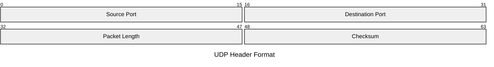

**伪首部**：

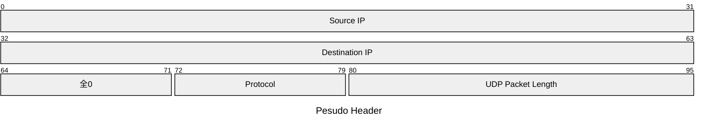

**检验**：

检验字段是可选的，源主机不想计算检验和，则该字段置0，若检验和恰好为0，则置全1

发送方计算检验和：

1. 添加伪首部
2. 两字节对齐，数据部分不足则0填充
3. 检验和字段置0
4. 二进制反码求和运算
   - 按位相加，带进位
   - 最高位进位回卷
5. 结果取反

接收方检验：

1. 加伪首部
2. 两字节对齐，不足填充
3. 二进制反码求和
4. 比对：若全1，无误交付；否则丢弃


## 4.3 TCP

TCP中数据称为Stream，数据分组称为Segment

**特点**：

- 面向连接
- 提供可靠交付服务
- 只有两个端点，只能是一对一的
- 面向字节流：视应用程序交下来的数据是一串无结构的**字节流**
- 提供全双工通信，都有发送缓存与接收缓存
  - 发送缓存：（1）应用程序给TCP准备的数据（2）TCP已发送但尚未确认的数据
  - 接收缓存：（1）按序到达但未被应用程序接收的数据（2）不按序到达的数据


**首部格式**：

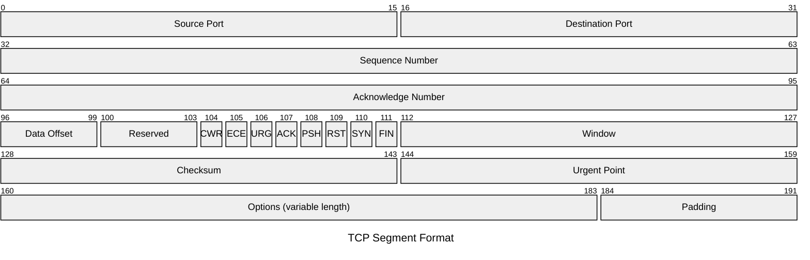

- `Sequence Number`：表示本报文段的传输的字节流数据的第一个字节的编号
- `Acknowledge Number`：在TCP确认报文中，若值是N，则表示N-1个字节已经收到，期待接收第N个字节
- `Data Offset`：指明TCP数据部分距离报文段的起始位置有多远，占4位，单位4B
- `CWR`：拥塞窗口减少
- `ECE`：显示拥塞回显
- `URG`：表明本报文段中有紧急数据，在发送方，将紧急数据插队到本报文段前面，就算Window为0，也可以发送紧急数据
- `ACK`：连接建立后，传送的所有报文ACK置1
- `PSH`：接收方收到PSH置1的报文段后，尽快交付，不必等待缓存满
- `RST`：通常用来出错时，释放连接，并重新建立连接，还可以拒绝非法报文段或拒绝打开一个连接
- `SYN`：在连接建立时用来同步序号；SYN=1表示这是一个连接请求或连接接收报文
- `FIN`：释放连接讯号
- `Window`：从本报文段首部的确认号算起，容许对方发送的数据量大小，单位字节
- `Urgent Point`：指明本报文段中，紧急数据的字节数（数据末尾在报文段的位置）

常用选项字段：

- `MSS`：4B，在SYN报文中使用，表示本端能接收的最大报文段长度，通常设置为（MTU-40）
- `Window Scale`：3B，在SYN报文中使用
- `sackOK`：2B，在SYN报文中使用，发送端支持并同意使用SACK


**连接管理**：

特点：

- TCP把连接作为最基本的抽象，两个端点唯一确定一条连接
- 采用C/S模式，主动发起连接的是Client，被动等待连接的是Server 

解决三个问题：

（1）是使每一方都能够感知对方的存在

（2）要允许双方协商一些参数（最大窗口值、是否使用窗口扩大选项、时间戳选项等）

（3）能够对运输实体资源进行分配（缓存大小、连接表项中的项目）

三次握手（three-way handshake）：

（1）SYN=1；seq=x

（2）SYN=1；ACK=1；seq=y；ack=x+1

（3）ACK=1；seq=x+1；ack=y+1（可以携带数据，否则不消耗序列号）

注意点：

- SYN报文段的初始序列号（ISN）都是随机的，防止TCP序号预测攻击

- ACK包并不意味着数据已经交付了上层应用

- 三次握手的目的：是为了"**防止已失效的连接请求报文段传送到了服务端，因而产生错误**"，也是即为了解决"**网络中存在延迟的重复分组**"

例子：若不进行第三次握手，服务端收到第一个SYN包（若是因为网络延迟，而失效的），就响应并建立连接，服务端会白白等待客户端发送数据，但客户端并没有想建立连接，会忽视这个第二次握手的SYN/ACK包

- 服务端重试策略：服务端会在SYN-RCVD状态等待第三次握手，在Linux默认重试次数为5，重试间隔会从1s开始每次翻倍，如1s、2s、4s、8s、16s	


四次挥手（four-way handshake）：

（1）FIN=1；seq=u

（2）ACK=1；seq=v；ack=u+1

（3）FIN=1；ACK=1；ceq=w；ack=u+1

（4）ACK=1；seq=u+1；ack=w+1

状态编码：

- LISTEN S
- SYN-SENT C
- SYN-RECIVED S
- ESTABLISHED S&C
- FIN-WAIT-1 S&C
- FIN-WAIT-2 S&C
- CLOSE-WAIT S&C
- CLOSING S&C
- LAST-ACK S&C
- TIME-WAIT S/C
- CLOSED S&C


**可靠的传输**：

（1）序号

（2）确认

- 累计确认（CACK）
- 捎带确认
- 冗余确认（DupACK）
- 选择确认（SACK）（TCP扩展）

（3）重传

- 超时：通过**Retransmission Timer**，问题是超时周期过长
- 冗余ACK：每次有失序报文段到达，立即发送冗余ACK；TCP规定当发送方收到连续3个对同一个报文的冗余ACK时，则执行快重传

（4）检验（同UDP）


**重要计时器**：

- `Retransmission Timer`：当发送方发出一个报文后，开始等待确认，如果在一定时间内没有收到ACK，触发重传

- `Keepalive Timer`：服务端每收到一次客户端数据，重置计时器。超时后，每75s，发送一个**keepalive probe**，最多连续发送10个 probe。
- `Persist Timer`：收到0窗口报文后，发送方超过一定时间，开始周期性发送 **zero window probe**（3次后RST），避免因为修改窗口报文的丢失而陷入死锁
- `TIME-WAIT Timer`：客户端FIN-2状态收到FIN包后，立即发送ACK报文，进入TIME-WAIT状态，等待2MSL时间后进入CLOSED
- `Connection Establishment Timer`：TCP连接建立过程中，防止三次握手响应时间过长，SYN报文丢失，TCP重传若干次，若仍无任何回应，则放弃


**流量控制**：

流量控制目的：是端到端的（区别于二层的点到点的流量控制）通过控制发送方发送分组的速率，以便接收方机器能顺利接收（来得及，否则丢包）

糊涂窗口综合症：接收端以小增量的形式处理数据，那么它会发送一系列小窗口，数据利用率低

解决方法：

- David D Clark算法（接收端）：若收到的数据导致windows size 小于某值，则直接ack把window关闭，直到window size大于等于MSS后或缓存空闲过半
- Nagle算法（发送端）：任意满足以下条件之一，则发送数据；否则积累数据（默认打开）
  - $\text{Window size} \ge MSS \ \&\   \text{Data size}\ge MSS$
  - 等待时间或者超时200ms


**拥塞控制**：

拥塞控制目的：通过控制发送方发送分组的速率，避免网络出现拥塞瘫痪

在通信端点的表现：拥塞发生时，端点通常不了解发生拥塞的细节，往往表现为通信时延的增加

TCP的发送方需考虑的因素：（1）接收方的接收能力（2）不使网络发生拥塞

TCP在发送方维持一个cwnd（拥塞窗口）

TCP控制拥塞的原则：只要没出现网络拥塞，就将cwnd调大一些；出现拥塞就调小一些

发送窗口的上限取值：$\min\{\text{rwnd},\text{cwnd}\}$

TCP的四种拥塞控制算法：

- 慢开始：初始拥塞窗口为1，指数递增，直到达到慢开始阈值（ssthresh）
- 拥塞避免：达到ssthresh后，cwnd线性增加
- 快重传：发现3个冗余ACK后，立即重传（不认为是网络拥塞，因为没有等到超时，3个冗余ACK，间接说明网络也没那么堵）
- 快恢复：发现3个冗余ACK后，将当前ssthresh设置为当前cwnd的一半，cwnd也设置为cwnd的一般，然后线性增加

无论是慢开始阶段，还是拥塞避免阶段，只要当网络拥塞发生了之后，采取**拥塞处理**算法：

cwnd置为1，ssthresh置为出现拥塞时的cwnd的一半

需要注意：

- 在慢开始阶段，若下个轮次 2cwnd>ssthresh，则下个轮次cwnd=ssthresh

总结：

- 慢开始+拥塞避免
  - TCP连接建立
  - 网络超时
- 快重传+快恢复
  - 3个冗余ACK


# 5 应用层


## 5.1 网络应用模型

**C/S模型**：

特点：

- 网络集中管理
- 客户端之间不可直接互相通信
- 网络存在瓶颈（受服务器硬件、带宽限制）：服务器只能支持一定数量的请求

**P2P模型**：

优点：

- 任务分配到各个节点，消除了对某个服务器的完全依赖
- 用户之间可以文件共享
- 支持的请求数量无限制
- 网络健壮性强（单个节点故障，不影响整个应用）

缺点：

- 节点内存占用高，影响处理速度（节点既是客户，又是服务器）
- 对硬盘损害大（依赖节点的存储空间）
- 占用网络流量高（依赖节点的上传带宽）
- 不稳定（节点随时下线、随时上线）
- 一致性维护困难
- 管控复杂（更新、配置、健康都困难）
- 安全性差（没有中心化的身份认证和访问控制）

## 5.2 DNS

**特点**：

- 基于UDP，端口53，工作在应用层
- C/S模式


**区概念**：一个服务器所负责管辖的（或有权限管辖的）范围称为区

- 小于等于域
- 区中的所有节点必须是能够连通的
- 每个区设置相应的权限域名服务器


**域名服务器体系架构**：

- 根域名服务器（13个）：是具有13个服务器的冗余集群，用来管辖顶级域名，它知道所有的顶级域名服务器的域名和IP地址
- 顶级域名服务器：管辖所有在它下面注册的所有二级域名（给出的结果可能是最后的结果，也可能是下一步应当查询的域名服务器的IP地址）
- 权限域名服务器
  - 每台主机都必须在权限域名服务器上登记
  - 一台主机最好至少有两个权限域名服务器
  - 许多权限域名服务器都同时充当本地域名服务器和权限域名服务器
  - 权限域名服务器总能将其管辖的主机名转换为该主机的IP地址
- 本地域名服务器
  - 每个ISP、大学，甚至大学下面的系都可以拥有一个本地域名服务器
  - 每个主机发出的DNS查询请求都发送给主机配置的本地域名服务器
  - windows上本地连接配置的DNS服务器就是本地域名服务器
  - 自己不能转换，则首先求助根服务器


**域名解析过程**：

两种解析方式：

- 递归查询：若查询不到主机名对应的IP地址，则本地域名服务器以DNS客户身份，向根域名服务器发起DNS查询报文（替该主机查询）
- 迭代查询：若查询失败，则由服务端返回下一个应该查询的IP地址

主机向本地域名服务器的查询都采用**递归查询**

本地域名服务器向其他域名服务器的查询采用**递归查询**或**迭代查询**


## 5.3 FTP

**历史沿革**：

1971年，由 **Abhay Bhushan** 编写，作为 ARPANET 的一部分，最早规范为《RFC 114》，建立在NCP之上

1980年，向TCP/IP迁移，发布了《RFC 765》

1985年，标准化，《RFC 959》，沿用至今：

- 控制连接
- 数据连接：
  - PORT：主动模式，熟知端口20
  - PASSIVE：被动模式，动态端口
- 用户身份认证：USER、PASS

1997年至今，出现FTPS和SFTP（基于SSH的完全不同的文件传输协议）

**特点**：

- 明文传输

- 允许用户指明文件的类型与格式
- 允许文件具有存储权限

- 带外传送（Out of Band）：控制信息与数据信息的传送分离
- 主进程接收新的请求，从进程处理单个请求
- 数据连接只是一次性的，传送完就关闭

**提供的功能**：

- 不同种类主机系统之间的文件传输能力
- 以用户权限管理的方式提供用户对远程FTP服务器上的文件管理能力
- 以匿名FTP方式提供公用文件共享能力


**数据连接**：

两种模式：

- 主动模式（PORT）：客户端随机开放端口，并告知服务器，服务器从20端口连接客户端的开放端口
- 被动模式（PASV）：服务器随即开放端口，并告知客户端，客户端连接服务器端口


控制连接：

客户端通过熟知端口21建立与服务器的控制连接

在文件传输时，还可以使用控制连接

控制连接在整个会话期间保持打开状态


## 5.4 SMTP

**历史沿革**：

1982年，制定标准《RFC 821》，由 **Jonathan B. Postel** 编写

2008年，制定《RFC 5322》，现代邮件标准格式

**特点**：

- SMTP用于发送邮件
- SMTP只能传输ASCII编码的内容
- 服务端监听熟知端口25


**电子邮件收发流程**：

- 调用用户代理编辑邮件
- 用户代理通过SMTP发送到**发送端服务器**（推）
- 发送端服务器通过SMTP发送到**接收端服务器**（推）
- 用户代理通过POP3或IMAP从**接收端服务器**拉取邮件


**电子邮件格式**：

- 首部：关键字+冒号+值
- 内容


**MIME**：对SMTP进行扩展，支持非ASCII编码内容进行传送

- 5个新首部：
  - MIME版本
  - 内容描述
  - 内容标识
  - 传送编码
  - 内容类型
- 定义了邮件内容格式
- 定义了传输编码


**SMTP通信阶段**：

- 连接建立：
  1. 发件方服务器的SMTP客户周期性扫描缓存，一发现有邮件缓存，就与收件方服务器建立TCP连接
  2. TCP连接建立之后，收件方SMTP服务器返回`220 Service Ready`
  3. SMTP客户向SMTP服务器发送`Hello`命令，附上发送方的主机名
- 邮件传送
  1. 发送方SMTP客户发送`MAIL`命令，附带发件人地址
  2. 若接收方SMTP服务器准备好接收，则回复`250 OK`
  3. 发送方发送一串`RCPT`命令（用于对地址的确认）
  4. 服务器对`RCPT`命令逐一回复
  5. 得到服务器的`OK`回答后，发送端发送`DATA`命令，表示要开始传送邮件的内容
  6. 服务器回复`354 Start mail input; end up with <CRLF>`
  7. 此时发送端开始发送邮件内容
- 连接释放
  1. 邮件内容发送完毕后，发送端发送`QUIT`命令
  2. 服务器回复`221`，表示同意释放TCP连接


**POP3**：

- C/S模式
- TCP连接
- 工作在110端口
- 两种工作方式
  - 下载并保留
  - 下载并删除


**IMAP**：

- 提供联机命令：
  - 远程文件夹中查询邮件
  - 创建文件夹
  - 不同文件夹之间移动邮件
- IMAP服务器维护会话用户的状态信息
- 允许用户代理只获得报文的某些部分（例如报文的首部，多部分MIME报文的一部分，适用于低带宽情况）


## 5.5 HTTP 

**特点**：

- 基于TCP

- 无连接的：在交换Http报文之前，不需要建立HTTP连接
- 无状态的：服务器不保存用户状态
- 既可使用非持续性连接，又可使用持续性连接（HTTP/1.1默认）
- 面向事务的
- 面向文本的（报文中每个字段都是ASCII码串，不定长）


**TCP连接**：

- 非持续性连接
- 持续性连接
  - 非流水线式
  - 流水线式


## 5.6 Telnet

**历史沿革**：

1969年，开发，主要用于ARPANET内

1973年，《RFC 318》定义了Telnet 基本协议架构，引入了控制字符和命令协商机制（IAC）

1983年，转向TCP/IP，《RFC 854》是最经典的Telnet版本	

**工作流程**：

1. Telnet 协商阶段
2. Telnet 登录阶段
3. 数据传输阶段（没有行缓冲，一个字符一个字符传输）
4. Telnet 退出


## 5.7 SSH

**历史沿革**：

- 1995年，一次校园内Telnet密码被窃听事件，促使芬兰学者 Tatu Ylönen 发明了SSH-1
- 1999年，由于SSH-1开始商业化，引起社区反感，OpenBSD项目组创建了OpenSSH
- 2002-2006年，由于SSH-1存在一些设计缺陷，缺乏模块化扩展，IETF制定新协议SSH-2

**特点**：

- 对称加密+非对称密钥交换+哈希完整性验证

**工作流程**：

1. 版本协商（Protocol Version ExChange）：若版本兼容，继续；否则，终止
2. 密钥交换（Key Exchange）
3. 服务器认证：客户端校验服务器的公钥，通常存储在`~\.ssh\known_hosts`
   - 若首次连接，会回显是否接收该主机公钥
4. 用户认证（Authentication）
   - 密码登录
   - 公钥登录：客户端将自己的公钥，放到服务器的`~\.ssh\authorized_keys`，服务器通过公钥发送Challenge，客户端破解成功则登录
   - GSSAPI或双因子
5. 安全通道建立


## 5.8 HTTPS

**工作流程**：

1. 客户端发起HTTPS请求
2. TCP连接建立（端口443）
3. TLS握手
4. ClientHello：客户端发送ClientHello消息，包含支持的TLS版本、加密套件列表、随机数等
5. ServerHello：服务器选择TLS版本、加密套件，返回ServerHello消息和自己的数字证书（含公钥）
6. 证书验证：客户端验证服务器证书的合法性（是否由受信任的CA签发，域名是否匹配，证书是否过期）
7. 密钥交换：客户端生成 **pre-master secret**，使用服务器公钥加密后发送服务器
8. TLS握手完成：互相发送**Finished**消息，确认握手成功
9. 加密通信阶段
10. 连接关闭


# 6 Bonus


## 6.1 Bluetooth

蓝牙协议栈：

- 应用层

- GATT（Generic Attribute Profile）（BLE）/OBEX/HID（Human Interface Device）（键鼠）/A2DP（Advanced Audio Distribution Profile）（音频）

- L2CAP（逻辑链路控制与适配协议）

- HCI（主机控制接口）

- 物理层（RF射频+基带控制）

工作流程：

- 设备处于发现模式，广播 Advertising 包
- 设备处于扫描模式，接收广播包并记录发送设备的信息
- 发起配对：扫描设备向广播设备发起 Connection Request
- 配对&配密：完成身份认证与加密设置
  - 简单配对（Just Works）
  - PIN
  - 数字确认
- 链路建立：建立物理链路，并分配一个连接句柄；配置链路参数，如MTU
- 数据通信


## 6.2 Zigbee

zigbee（802.15.4）协议栈：

- 应用层：AF+ZDO+APS

- 网络层

- MAC层

- 物理层