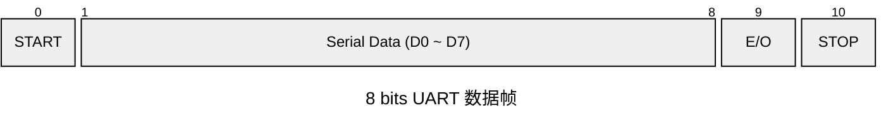

# 一、UART

全称 **Universal Asynchronous Receiver/Transmitter**

是一种**点对点**串行通用**异步**收发器，没有时钟线，采用**波特率**对齐（接收端根据约定的波特率，预测采样时间点，通常在数据位的中间进行采样）

常用配置：115200，8N1

**同步与异步：**

同步通信是指，双方在同一时钟的控制下，同步传输数据；

异步通信是指，双方用各自的时钟控制数据的发送和接收过程；

**🧩接口结构：**

- TX：单向，串行数据发送端
- RX：单向，串行数据接收端

**数据帧格式：**

- 起始位：低电平0（时间锚点，每一帧进行re-synchronization）
- 数据：可配置 5~9 bits，LSB在前，MSB在后
- 校验位（可选）：
  - None
  - Even
  - Odd
- 停止位：高电平1
  - 1bit 时间
  - 1.5 bit 时间 
  - 2 bit 时间

**标准规范**

（1）链路空闲状态：连续发送高电平1

（2）接收端采样：在数据位周期中间进行采样

（3）先发低位数据

# 二、IIC

全称 **Inter Integrated-Circuit**

是一种**串行同步通信总线**协议，支持多主、主从模式（常用）

理念：用最少的接口实现组件间通信

**🧩总线接口结构：**

- SCL：时钟线，用于同步数据
- SDA：双向、串行数据线

开漏结构（Open Drain），两条线需要接上拉电阻

**如何对齐帧？**

（1）起始条件

- SCL = 1
- SDA = 1 -> 0 跳变

（2）停止条件

- SCL = 1
- SDA = 0 -> 1 跳变

**数据格式规范：**

（1）每传送 8 bit（一个字节），需要一个周期的应答时间

（2）MSB First

**采样规范：**

（1）在 SCL 低电平更新

（2）在 SCL 高电平保持

**对存储器件的操作时序：**

起始信号+控制字节+地址字节+数据字节+停止信号

- 控制字节（ 7 bit 器件地址+读/写控制位）
- 地址字节 
- 数据字节

注：I2C 规范里的 7 bit 器件地址上限位是128 个，能用的只有 112 个

**I2C存储器件的读写操作**

读写控制位：高电平读，低电平写

（1）写操作

- 字节写（单次写）
- 页写（连续写）

（2）读操作

- 当前地址读
- 随机地址读（Dummy Write + 当前地址读）
- 连续读（将主机未应答设置位主机应答）

# 三、SPI

全称 **Serial Peripherial Interface** 

是一种**高速串行同步通信总线协议** ，介于经典总线与点对点之间

工作在单主多从模式，从设备没有地址，通过片选线控制选择从机

**是否共享信号线？**

✔️SCLK

✔️MOSI

✔️MISO

❌CS

**Master 接口结构：**

- SCLK
- MOSI：主机发送线
- MISO：主机接收线
- CS：片选线

# 四、IIS

全称 **Inter-IC Sound**

是一种**串行同步数字音频接口协议**，是点对点协议

**🧩接口结构：**

- BCLK：位时钟，对齐 bit
- LRCK（WS）：左右声道同步时钟，等于采样率
  - 低电平：左声道
  - 高电平：右声道

- SD（SDA）：单向，串行数据线
- MCLK（可选）：Master Clock，提供给 Codec 的高精度基准时钟，一般为采样率 Fs 的256倍（在 Codec 主模式下，不需外部提供）

**⭐重要规范：**

（1）MSB first： 最高有效位在前，先被发送

（2）LRCK 翻转之后的第二个时钟周期，才传输数据

（3）发送方：下降沿更新数据；接收方：上升沿采样数据

# 五、CAN

全称 **Controller Area Network**

是一种**串行自同步通信总线协议**，多主模式

✔Shared Bus 结构

❌Switched Fabric 结构

- 多主模式
- 共享总线
- 差分传输
- 面向消息

# 六、PCIe

全称 **Peripherial Component Interconnect Express**

是一种**高速外设互连串行同步通信总线协议**（实际上是点对点的交换结构，类似以太网交换机）

✔Switched Fabric 结构

❌Shared Bus 结构

# 七、SMI

全称 **Serial Management Interface**

是 MAC 与 PHY 之间的配置接口协议

**📌特点：**

- 一主多从模式（无总线仲裁）
- 共享总线（通过地址，选择从机）
- 同步传输（有时钟线）
- 上拉电阻驱动

**🧩接口结构：**

- MDC：管理数据时钟线（不大于12.5MHz）
- MDIO：双向、串行数据线

**🧩数据帧结构：**

- Preamble（32 bit）：前导码，全1
- Start（2 bit）：开始标志位，01
- OpCode（2 bit）：读写控制位，读：10；写：01
- PHY addr（5 bit）
- Register addr（5 bit）
- TA（2 bit）：转向位，读：Z0；写：10
- Data（16 bit）

空闲时：MDIO = Z

**其他规范：**

- MSB First

# 八、RGMII

全称 **Reduced Gigabit Media Independent Ineterface**

是 MAC 控制器与 PHY 芯片的**精简千兆数据接口**

**🧩接口结构：**

- RX_CLK
- RX_CTRL
- RX_DATA
- TX_CLK
- TX_CTRL
- TX_DATA

⚔️**与其他数据接口对比**

| 接口      | 数据线数       | 时钟            |
| --------- | -------------- | --------------- |
| MII       | 4 bit（100M）  | 25 MHz          |
| RMII      | 2 bit（100M）  | 50 MHz          |
| GMII      | 8 bit（1000M） | 125 MHz         |
| **RGMII** | **4 bit DDR**  | **125 MHz DDR** |
