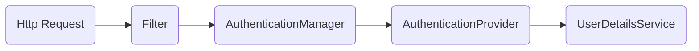

# 一、基础


## 1.1 处理步骤

如果一个请求到来，**SpringSecurity** 会按照以处理步骤。



1. **Filter**

   > 拦截Http请求，获取用户名和秘密等认证信息
   >
   > 
   >
   > 关键方法：
   >
   > ```java
   > public abstract Authentication attemptAuthentication(HttpServletRequest request, HttpServletResponse response)
   >         throws AuthenticationException, IOException, ServletException;
   > ```

2. **AuthenticationManager**

   > 从filter中获取认证信息，然后查找合适的AuthenticationProvider来发起认证流程
   >
   > 
   >
   > 关键方法：
   >
   > ```java
   > Authentication authenticate(Authentication authentication) throws AuthenticationException;
   > ```

3. **AuthenticationProvider**

   > 调用UserDetailsService来查询已经保存的用户信息并与从http请求中获取的认证信息比对。如果成功则返回，否则则抛出异常。
   >
   > 
   >
   > 关键方法：
   >
   > ```java
   > protected abstract UserDetails retrieveUser(String username, UsernamePasswordAuthenticationToken authentication)
   >             throws AuthenticationException;
   > ```

4. **UserDetailsService**

   > 负责获取用户保存的认证信息，例如查询数据库。
   >
   > 
   >
   > 关键方法：
   >
   > ```java
   > UserDetails loadUserByUsername(String username) throws UsernameNotFoundException;
   > ```


默认实现：

- **Filter：** UsernamePasswordAuthenticationFilter
- **AuthenticationManager：** ProviderManager
- **AuthenticationProvider：** DaoAuthenticationProvider 
- **UserDetailsService：** InMemoryUserDetailsManager


## 1.2 过滤器链


### 1.2.1 速览

| 次序 | 过滤器                                   | 描述                                                         |      |
| ---- | ---------------------------------------- | ------------------------------------------------------------ | ---- |
| 1    | DisableEncodeUrlFilter                   |                                                              |      |
| 2    | ForceEagerSessionCreationFilter          |                                                              |      |
| 3    | ChannelProcessingFilter                  | 通常是用来过滤哪些请求必须用 `https` 协议， 哪些请求必须用 `http` 协议， 哪些请求随便用哪个协议都行 |      |
| 4    | WebAsyncManagerIntegrationFilter         |                                                              |      |
| 5    | SecurityContextHolderFilter              |                                                              |      |
| 6    | SecurityContextPersistenceFilter         | 主要控制 `SecurityContext` 的在一次请求中的生命周期 。请求来临时，创建`SecurityContext` 安全上下文信息，请求结束时清空 `SecurityContextHolder` |      |
| 7    | HeaderWriterFilter                       | HeaderWriterFilter` 用来给 `http` 响应添加一些 `Header`,比如 `X-Frame-Options`, `X-XSS-Protection` ，`X-Content-Type-Options |      |
| 8    | CorsFilter                               |                                                              |      |
| 9    | CsrfFilter                               | `CsrfFilter` 用于防止`csrf`攻击，前后端使用json交互需要注意的一个问题。 |      |
| 10   | LogoutFilter                             | `LogoutFilter` 很明显这是处理注销的过滤器。你可以通过 `HttpSecurity.logout()` 来定制注销逻辑，非常有用。 |      |
| 11   | X509AuthenticationFilter                 | `X509` 认证过滤器。你可以通过 `HttpSecurity#X509()` 来启用和配置相关功能。 |      |
| 12   | AbstractPreAuthenticatedProcessingFilter | `AbstractPreAuthenticatedProcessingFilter` 处理处理经过预先认证的身份验证请求的过滤器的基类，其中认证主体已经由外部系统进行了身份验证。目的只是从传入请求中提取主体上的必要信息，而不是对它们进行身份验证。 |      |
| 13   | UsernamePasswordAuthenticationFilter     | 处理用户以及密码认证的核心过滤器。认证请求提交的`username`和 `password`，被封装成`token`进行一系列的认证，便是主要通过这个过滤器完成的，在表单认证的方法中，这是最最关键的过滤器。 |      |
| 14   | DefaultLoginPageGeneratingFilter         | 生成默认的登录页。默认 `/login`                              |      |
| 15   | DefaultLoginPageGeneratingFilter         | 生成默认的退出页。默认 `/logout` 。                          |      |
| 16   | ConcurrentSessionFilter                  | 主要用来判断`session`是否过期以及更新最新的访问时间          |      |
| 17   | DigestAuthenticationFilter               |                                                              |      |
| 18   | BasicAuthenticationFilter                | 和`Digest`身份验证一样都是`Web` 应用程序中流行的可选的身份验证机制 。 `BasicAuthenticationFilter` 负责处理 `HTTP` 头中显示的基本身份验证凭据。这个 **Spring Security** 的 **Spring Boot** 自动配置默认是启用的 。 |      |
| 19   | RequestCacheAwareFilter                  |                                                              |      |
| 20   | SecurityContextHolderAwareRequestFilter  | 用来 实现`j2ee`中 `Servlet Api` 一些接口方法, 比如 `getRemoteUser` 方法、`isUserInRole` 方法，在使用 **Spring Security** 时其实就是通过这个过滤器来实现的。 |      |
| 21   | JaasApiIntegrationFilter                 | 适用于`JAAS` （`Java` 认证授权服务）。如果 `SecurityContextHolder` 中拥有的 `Authentication` 是一个 `JaasAuthenticationToken`，那么该 `JaasApiIntegrationFilter` 将使用包含在 `JaasAuthenticationToken` 中的 `Subject` 继续执行 `FilterChain`。 |      |
| 22   | RememberMeAuthenticationFilter           | 处理 **`记住我`** 功能的过滤器。                             |      |
| 23   | AnonymousAuthenticationFilter            | 匿名认证过滤器。**对于 `Spring Security` 来说，所有对资源的访问都是有 `Authentication` 的。对于无需登录（`UsernamePasswordAuthenticationFilter` ）直接可以访问的资源，会授予其匿名用户身份**。 |      |
| 24   | SessionManagementFilter                  | `Session` 管理器过滤器，内部维护了一个 `SessionAuthenticationStrategy` 用于管理 `Session` 。 |      |
| 25   | ExceptionTranslationFilter               | 主要来传输异常事件                                           |      |
| 26   | FilterSecurityInterceptor                | 这个过滤器决定了访问特定路径应该具备的权限，访问的用户的角色，权限是什么？访问的路径需要什么样的角色和权限？这些判断和处理都是由该类进行的。**如果你要实现动态权限控制就必须研究该类** 。 |      |
| 27   | AuthorizationFilter                      |                                                              |      |
| 28   | SwitchUserFilter                         | `SwitchUserFilter` 是用来做账户切换的。默认的切换账号的`url`为`/login/impersonate`，默认注销切换账号的`url`为`/logout/impersonate`，默认的账号参数为`username` 。 |      |


### 1.2.2 默认启动过滤器

1. DisableEncodeUrlFilter
2. WebAsyncManagerIntegrationFilter
3. SecurityContextHolderFilter
4. HeaderWriterFilter
5. CsrfFilter
6. LogoutFilter
7. UsernamePasswordAuthenticationFilter
8. DefaultLoginPageGeneratingFilter
9. DefaultLoginPageGeneratingFilter
10. BasicAuthenticationFilter
11. RequestCacheAwareFilter
12. SecurityContextHolderAwareRequestFilter
13. AnonymousAuthenticationFilter
14. ExceptionTranslationFilter
15. AuthorizationFilter


# 二、配置


## 2.1 WebSecurityConfigurerAdaptor

1. anyRequest

   > 匹配所有请求路径

2. access

   > SpringEl表达式结果为true时可以访问

3. anonymous

   > 匿名可以访问

4. denyAll

   > 用户不能访问

5. fullyAuthenticated

   > 用户完全认证可以访问（非remember-me下自动登录）

6. hasAnyAuthority

   > 如果有参数，参数表示权限，则其中任何一个权限可以访问

7. hasAnyRole

   > 如果有参数，参数表示角色，则其中任何一个角色可以访问 

8. hasAuthority

   > 如果有参数，参数表示权限，则其权限可以访问

9. hasIpAddress

   > 如果有参数，参数表示IP地址，如果用户IP和参数匹配，则可以访问

10. hasRole

    > 如果有参数，参数表示角色，则其角色可以访问

11. permitAll

    > 用户可以任意访问

12. rememberMe

    > 允许通过remember-me登录的用户访问

13. authenticated

    > 用户登录后可访问


# 三、配置（6.0）


## 3.1 配置类

```java
@EnableWebSecurity
@Configuration
@EnableMethodSecurity
public class SecurityConfiguration {

    @Bean
    public SecurityFilterChain filterChain(HttpSecurity httpSecurity) throws Exception{
        return httpSecurity.authorizeHttpRequests(authorize-> {
                    try {
                        authorize
                                // 放行登录接口
                                .requestMatchers("/login").permitAll()
                                // 其余的都需要权限校验
                                .anyRequest().authenticated()
                                // 防跨站请求伪造
                                .and().csrf(csrf -> csrf.disable());
                    } catch (Exception e) {
                        throw new RuntimeException(e);
                    }
                }
        ).build();

    }
    
    // 密码编码器
    @Bean
    public PasswordEncoder passwordEncoder(){

        return new BCryptPasswordEncoder();
    }


}
```

