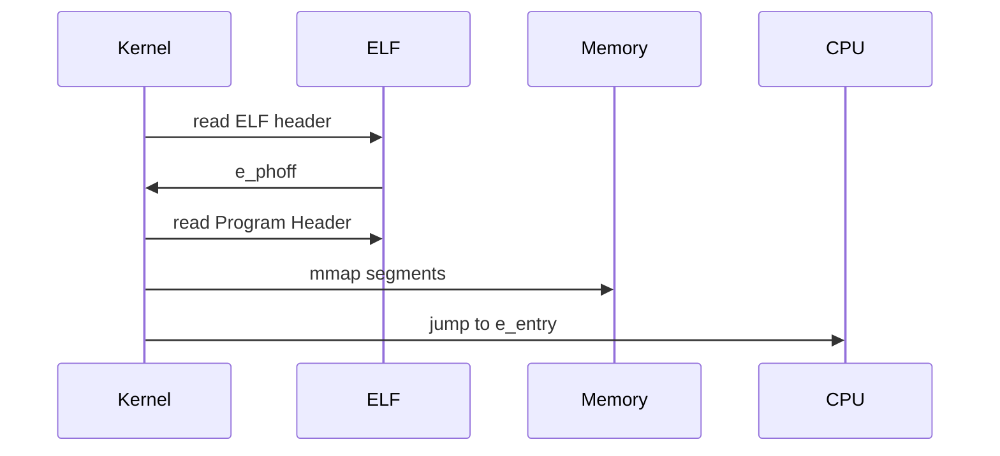
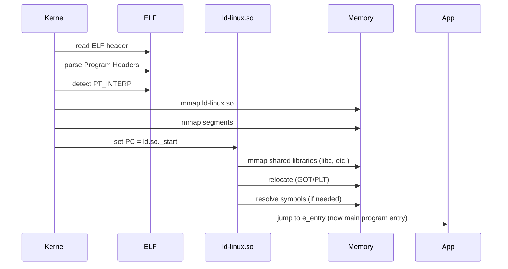
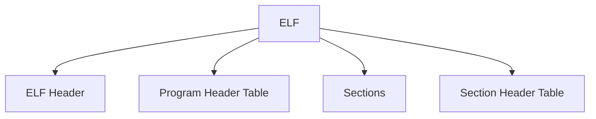

# 一、ELF 概述

ELF 全称 **Executable and Linkable Format** 是 Linux/Unix 下的一种**容器格式**

⚔️它直接对标 Windows PE、Mach-O

区分概念：

* 软件：指令序列，由操作系统加载并执行
* 固件：指令序列，通常烧录在 Flash 上，直接运行在设备上，控制硬件

软件执行时序（静态链接版本）：



软件启动时序（动态链接版本）：




**ld-linux.so 负责**

- 找动态库
- mmap 动态库
- 做 relocation 
- 解析符号


所依赖动态库名（**SONAME**）存放在 `.dynamic`


**🧩整体结构：**

* ELF Header
* Program Header Table（REL 文件通常无）
* Sections（存放各种 Section/data）
* Section Header Table



**🧩ELF Header 结构**

* Magic Number（4 B）：0x74 'E' 'L' 'F'
* Class（2 B）
* Data Encoding（2 B）：端序
* Version：ELF 的版本
* OS/ABI：例如 Linux System V
* ABI Version
* Type（File）：EXEC/DYN/REL
* Machine（Arch）：AMD 64
* Version
* Entry Point Address：_start 地址（REL 文件为0）
* Start of Progam Headers：Program Header Table 的文件内偏移地址
* Start of Section Headers
* Flag：架构相关的扩展信息，x86-64 通常为0
* Size of this Header：52 B（32 bit）or 64 B（64 bit）
* Size of Program Headers：单个 Program Header 大小
* Number of Program Headers：Program Header 数量
* Size of Section Headers
* Number of Section Headers


# 二、目标文件


## 1. Section Header 表

Section Header 字段解读:

| 字段          | 大小      | 含义                           |
| ----------- | ------- | ---------------------------- |
| `name`      | 4 bytes | section 名字（在 .shstrtab 中的偏移） |
| `type`      | 4 bytes | section 类型                   |
| `flags`     | 8 bytes | 属性标志                         |
| `addr`      | 8 bytes | 内存地址（运行时）                    |
| `offset`    | 8 bytes | 文件中的偏移 ⭐                     |
| `size`      | 8 bytes | section 大小 ⭐                 |
| `link`      | 4 bytes | 关联 section 索引                |
| `info`      | 4 bytes | 附加信息                         |
| `addralign` | 8 bytes | 对齐要求                         |
| `entsize`   | 8 bytes | 每个 entry 的大小                 |

Section Type 可选值解读：

| 类型         | 用途    | 是否占文件 |
| ---------- | ----- | ----- |
| PROGBITS   | 代码/数据 | ✔     |
| NOBITS     | .bss  | ❌     |
| SYMTAB     | 符号表   | ✔     |
| STRTAB     | 字符串   | ✔     |
| REL / RELA | 重定位   | ✔     |
| DYNAMIC    | 动态链接  | ✔     |
| NOTE       | 元信息   | ✔     |
| NULL       | 空     | ❌     |

Section Flags 解读：

| 缩写  | 含义         | 常见用途       |
| --- | ---------- | ---------- |
| A   | Alloc      | 进入内存       |
| W   | Write      | 可写数据       |
| X   | Execute    | 代码         |
| I   | Info       | linker 信息  |
| S   | Strings    | 字符串表       |
| M   | Merge      | 优化合并       |
| L   | Link order | 排序依赖       |
| G   | Group      | COMDAT     |
| T   | TLS        | 线程变量       |
| C   | Compressed | 压缩 section |


## 2. Sections

Section Name 解读：

注：通过在 `shstrtab` 中的偏移，读取 `section` 的名字字符串

| Section Name | 类型     | 内容                  | 是否占文件 | 是否进内存 | 可执行 | 作用           |
| ------------ | -------- | --------------------- | ---------- | ---------- | ------ | -------------- |
| `.text`      | PROGBITS | 机器指令              | ✔          | ✔          | ✔      | 程序代码段     |
| `.data`      | PROGBITS | 已初始化全局/静态变量 | ✔          | ✔          | ❌      | 可读写数据     |
| `.bss`       | NOBITS   | 未初始化全局/静态变量 | ❌          | ✔          | ❌      | 运行时清零内存 |
| `.rodata`    | PROGBITS | 只读常量（字符串等）  | ✔          | ✔          | ❌      | 常量数据       |
| `.strtab`    | STRTAB   | symbol 名字字符串表   | ✔          | ❌          | ❌      | 符号名表       |
| `.shstrtab`  | STRTAB   | section 名字字符串    | ✔          | ❌          | ❌      | section 名字表 |
| `.symtab`    | SYMTAB   | 符号表（函数/变量）   | ✔          | ❌          | ❌      | 静态链接信息   |
| `.dynsym`    | DYNSYM   | 动态符号表            | ✔          | ✔          | ❌      | 动态链接       |
| `.dynstr`    | STRTAB   | 动态符号字符串        | ✔          | ✔          | ❌      | 动态链接字符串 |
| `.rela.text` | RELA     | 重定位信息            | ✔          | ❌          | ❌      | 链接修复地址   |
| `.rel.text`  | REL      | 重定位（无 addend）   | ✔          | ❌          | ❌      | 老格式重定位   |
| `.dynamic`   | DYNAMIC  | 动态链接信息          | ✔          | ✔          | ❌      | loader 使用    |
| `.got`       | PROGBITS | 全局偏移表            | ✔          | ✔          | ❌      | 动态地址解析   |
| `.plt`       | PROGBITS | 函数跳转表            | ✔          | ✔          | ✔      | 动态函数调用   |
| `.interp`    | PROGBITS | 动态加载器路径        | ✔          | ✔          | ❌      | ld-linux.so    |

`.plt` 全称 **Procedure Linkage Table**


## 3. 符号表

symtab 解读：

| 字段      | 大小      | 含义                   | 数据来源      | 关键作用           |
| ------- | ------- | -------------------- | --------- | -------------- |
| `name`  | 4 bytes | 符号名字在 `.strtab` 中的偏移 | `.strtab` | 找到函数/变量名称      |
| `value` | 8 bytes | 符号地址或偏移              | linker    | 运行地址/偏移        |
| `size`  | 8 bytes | 符号大小（bytes）          | linker    | 函数/变量大小        |
| `Type`  | 4 bits  | 类型编码                 | 编译器/链接器   | 描述符号性质         |
| `Bind`  | 4 bits  | 绑定                   |           |                |
| `Vis`   | 1 byte  | 可见性信息                | 编译器       | 控制符号可见性        |
| `shndx` | 2 bytes | 所属 section 索引        | linker    | 符号属于哪个 section |

注：`shndx` 全称 Section Header Index


## 4. 重定位表

> 记录需要重定向修改的位置

rela 解读：

| 字段                   | 大小      | 含义                             |
| -------------------- | ------- | ------------------------------ |
| `offset`             | 8 bytes | 要修改的位置（在 section/segment 中的偏移） |
| `Symbol Index(info)` | 4 B     | 符号索引（用在 `strtab` 中查名字）         |
| `Type(info)`         | 4 B     | 重定位计算公式                        |
| `Symbol's Value`     | 8 bytes |                                |
| `addend`             | 8 bytes | 额外偏移量（修正值）                     |

Type 字段详解

| Type              | 含义     | 作用             |
| ----------------- | ------ | -------------- |
| R_X86_64_64       | 绝对地址   | 写入完整 64-bit 地址 |
| R_X86_64_PC32     | PC 相对  | 用于 call/jump   |
| R_X86_64_PLT32    | PLT 调用 | 动态函数调用         |
| R_X86_64_GLOB_DAT | 全局变量   | 写 GOT          |
| R_X86_64_COPY     | 复制数据   | 动态库变量拷贝        |
| R_X86_64_RELATIVE | 相对重定位  | 基址修正           |

👉 Type 决定：

> 🧠 “重定位公式”

不同 Type = 不同计算方式


# 三、可执行文件

可直接由**操作系统（Kernal）**加载（**execve()**），并运行的文件，其装载了程序（指令、数据）、装载运行的相关信息

**ELF** 定义了 2 种可执行文件：

- DYN：现代主流
- EXEC（已不常用）


## 1. Program Header 表

Program Header Table 字段解读

| 字段         | 含义    | 作用（通俗解释）                           |
| ---------- | ----- | ---------------------------------- |
| `Type`     | 段类型   | 这个 segment 是干什么的（代码/数据/动态链接等）      |
| `Offset`   | 文件内偏移 | 这个 segment 在 ELF 文件中的起始位置          |
| `VirtAddr` | 虚拟地址  | 加载到内存后的地址（VMA）                     |
| `PhysAddr` | 物理地址  | 早期设计用，现代 Linux 基本忽略                |
| `FileSiz`  | 文件内大小 | 在文件中占多少字节                          |
| `MemSiz`   | 内存大小  | 加载到内存后占多少字节（可能比 FileSiz 大，比如 .bss） |
| `Flag`     | 权限标志  | 该段内存权限（R/W/X）                      |
| `Align`    | 对齐方式  | 内存/文件映射时的对齐要求                      |

Type 可选值：

| Type      | 含义                          |
| --------- | ----------------------------- |
| `LOAD`    | 可加载段（代码/数据，最重要） |
| `DYNAMIC` | 动态链接信息段                |
| `INTERP`  | 动态加载器路径（ld-linux.so） |
| `PHDR`    | Program Header 自身的位置     |
| `NOTE`    | 附加信息（ABI / build-id）    |


## 2. PLT

全称 **Procedure Linkage Table**，是一组**跳板函数（Stub）**，每个外部函数对应一个 **Stub**


经典**延迟绑定（lazy-binding）**机制：

- 第一次调用时才去解析（经过`ld`），存放在 GOT（慢）
- 后续调用直接从 GOT 取（不经过`ld`）（快）


结构：

- 动态连接器入口
- 外部函数 1 跳板
- 外部函数 2 跳板
- ...
- 外部函数 n 跳板


动态链接器入口内部代码 **PLT[0]**：

```assembly
push GOT[1] #link-table 入栈
jmp  GOT[2] #跳转 _dl_runtime_resolve()
```


外部函数跳板内部代码：

```assembly
push 序号    #外部函数 Index 入栈
jmp  PLT[0] #跳转 PLT[0]
```


现代方法采用 `.plt.sec` 直接跳转到 GOT ，不需要再绕 `PLT[0]`，优化了调用路径


## 3. GOT

全称 **Global Offset Table**，每个 entry 存放一个地址（虚拟地址）


System V ABI 经典布局：

- GOT[0] = reserved
- GOT[1] = link_map
- GOT[2] = _dl_runtime_resolve（动态链接器的 runtime resolver 地址）
- GOT[3] = _dl_runtime_profile (optional)


查看 .got 内容

```bash
readelf -x .got
```

通常在可执行文件里面 GOT[1]、GOT[2] 是0，表示未初始化（占位）

它由 `ld.so` 在运行时初始化（`ld.so` 做 relocation）


#  四、链接过程


## Build-Essential

常用工具： 

- `gcc`
- `g++`
- `make`：Makefile 构建工具


Binutils：

- `ld`
- `as`
- `ar`
- `nm`
- `objdump`


🧠区分几个概念：

在 `build-essential` 包下

- `gcc`：是高层驱动器

- `ld`：是底层链接器，只负责最原始的链接功能，不会额外添加任何目标文件，不知道 `crt1.o`、`crti.o`、`crtn.o` 等运行时库

如果你要手动编译并链接（使用`ld`），应输入：

```bash
ld main.o crt1.o crti.o crtn.o crtbegin.o crtend.o -dynamic-linker /lib64/ld-linux-x86-64.so.2  -lc -o main
```


## C 运行时启动框架

是一整套将 C 程序的 `main()` 变成可执行程序的基础设施

包含：

- 启动文件
- C runtimes （libc）
- 编译器 runtimes（libgcc）
- 动态加载器（ld-linux）


**五个启动文件（Startup Objects）**

- `crt1.o`：提供`_start`，调用 `__libc_start_main`（来自`glibc`）
- `crti.o`：**（Dreprecated）**提供`_init`、`_fini`，函数入口，属于全局初始化，只执行一次
- `crtn.o`：**（Dreprecated）**提供`.init`、`.fini`，函数出口，属于全局初始化，只执行一次
- `crtbegin.o`：提供 4 个 section
  - `deregister_tm_clones`：TLS_clone 析构
  - `register_tm_clones`：TLS_clone 构造
  - `__do_global_dtors_aux`：析构函数表
  - `frame_dummy`

- `crtend.o`：无可执行 section，用来结尾占位，配合 `crti.o`/`crtn.o` 机制

新版本 `glibc-2.40+` 已经将 `_init` 和 `_fini` 机制弱化，初始化流程已经转移，仅留下来作兼容接口

事实：`crti.o`、`crtn.o` 仍存在，只提供兼容接口

现代程序初始化已经完全由 `__libc_start_main` + `.init_array `接管。

`_init` 在`__libc_start_main` 的兼容旧路径中被调用，用来判断 `gmon_start` 是否存在


`glibc` 有两个文件

- 动态库：`/lib/x86_64-linux-gnu/libc.so.6`
- 静态库：`libc.a`


`gcc` 驱动器编译 `main.c` 文件时，等价于底层调用链接器执行：

```bash
ld main.o crt1.o crti.o crtn.o crtbegin.o crtend.o -dynamic-linker /lib64/ld-linux-x86-64.so.2  -lc -o main
```

`-lc`：使用库 `glibc` ，默认动态链接，所以源头来自`/lib/x86_64-linux-gnu/libc.so.6`

`-dynamic-linker`：指定动态链接器

这个框架提供了能够执行 C 程序中 main 函数的能力，因为链接器认识的真正程序入口是`_start`


# 五、相关工具

GNU binutil 下，进行 ELF 链接/分析工具

**两套工具对比：**

| 工具    | 本质定位                                |
| ------- | --------------------------------------- |
| readelf | **ELF格式解析器（纯结构分析）**         |
| objdump | **反汇编 + 二进制分析工具（逆向视角）** |


## 1. readelf

| 参数   | 作用                                      |
| ---- | --------------------------------------- |
| `-h` | 查看 ELF Header（文件基本信息）                   |
| `-l` | 查看 Program Header Table（加载段 / segments） |
| `-S` | 查看 Section Header Table（所有 section）     |
| `-s` | 查看 symtab                               |
| `-r` | 查看 rela.text                            |
| `-W` | 宽，不换行                                   |
| `-x` | 以16进制格式，查看某 section                     |


## 2. objdump

| 指令  | 作用                              |
| ----- | --------------------------------- |
| `-d ` | 反汇编可执行代码                  |
| `-D`  | 反汇编所有 section（更全）        |
| `-M`  | 选择语法（推荐）（GNU 默认 AT&T） |
| `-f`  | 查看文件头信息                    |
| `-h`  | 查看 section table                |
| `-R`  | 重定位表                          |
| `-T`  | 动态符号解析                      |


## 3. nm

全称 **Name Map**

作用：查看目标文件、静态库、可执行文件的符号表	


## 4. ldd

全称 **List Dynamic Dependencies**

作用：列出可执行文件，所依赖的所有动态库

输出格式：（动态链接器只需要加载路径）

依赖的库名 => 实际加载路径 （映射的虚拟地址）

例子：

```bash
 ldd main
```

输出：

```bash
linux-vdso.so.1 (0x00007fff29dac000)
libc.so.6 => /usr/lib/x86_64-linux-gnu/libc.so.6 (0x00007a5e75e00000)
/lib64/ld-linux-x86-64.so.2 (0x00007a5e7616b000)
```

- linux-vdso.so.1：全称 virtual dynamic shared object
- libc.so.6：动态库
- ld-linux：动态加载器


## 5. gcc


| 指令                      | 作用                                                         |
| ------------------------- | ------------------------------------------------------------ |
| `-shared`                 | 创建动态库                                                   |
| `-fPIC`                   | 生成位置无关代码                                             |
| `-c`                      | 生成目标文件                                                 |
| `-S`                      | 生成汇编文件                                                 |
| `-E`                      | 生成预处理文件                                               |
| `-o`                      | 指定输出容器                                                 |
| `-masm=intel`             | 指定汇编风格，默认 AT&T                                      |
| `-L`                      | 库搜索路径，编译时；动态库需要在**运行时**搜索，需要设置 `LD_LIBRARY_PATH` |
| `-l`                      | 指定库名                                                     |
| `-static`                 | 静态链接开关                                                 |
| `-print-file-name=<file>` | 打印库文件的全局路径                                         |
| `-dumpspecs`              | 打印 `built in specs`                                        |
| `-Wl,rpath=<path>`        | 将路径写入 ELF                                               |


# 六、Symbol ⚔️ Label

Label 是 Symbol 的子集
