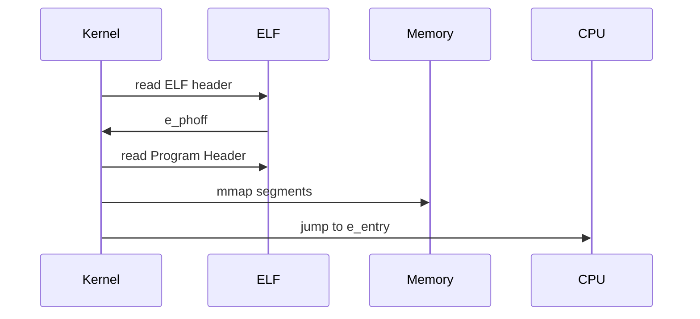
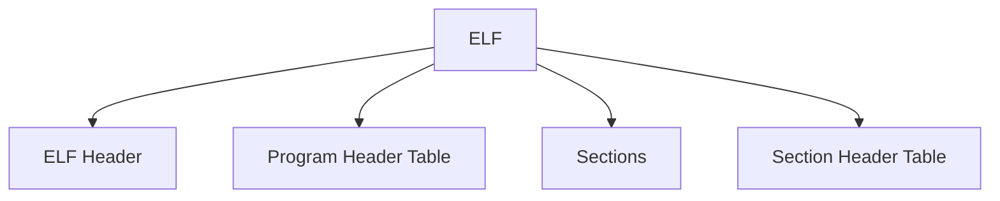

# 一、ELF 概述

ELF 全称 **Executable and Linkable Format** 是 Linux/Unix 下的一种容器格式化

⚔️它直接对标 Windows PE、Mach-O


区分概念：

- 软件：指令序列，由操作系统加载并执行

- 固件：指令序列，通常烧录在 Flash 上，直接运行在设备上，控制硬件


软件执行时序：




**🧩整体结构：**

- ELF Header
- Program Header Table（REL 文件通常无）
- Sections（存放各种 Section/data）
- Section Header Table




**🧩ELF Header 结构**

- Magic Number（4 B）：0x74 'E' 'L' 'F'
- Class（2 B）
- Data Encoding（2 B）：端序
- Version：ELF 的版本
- OS/ABI：例如 Linux System V
- ABI Version
- Type（File）：EXEC/DYN/REL
- Machine（Arch）：AMD 64
- Version
- Entry Point Address：_start 地址（REL 文件为0）
- Start of Progam Headers：Program Header Table 的文件内偏移地址
- Start of Section Headers
- Flag：架构相关的扩展信息，x86-64 通常为0
- Size of this Header：52 B（32 bit）or 64 B（64 bit）
- Size of Program Headers：单个 Program Header 大小
- Number of Program Headers：Program Header 数量
- Size of Section Headers
- Number of Section Headers


# 二、REL 类型


## 1. Section Header 表

Section Header 字段解读:

| 字段        | 大小    | 含义                                  |
| ----------- | ------- | ------------------------------------- |
| `name`      | 4 bytes | section 名字（在 .shstrtab 中的偏移） |
| `type`      | 4 bytes | section 类型                          |
| `flags`     | 8 bytes | 属性标志                              |
| `addr`      | 8 bytes | 内存地址（运行时）                    |
| `offset`    | 8 bytes | 文件中的偏移 ⭐                        |
| `size`      | 8 bytes | section 大小 ⭐                        |
| `link`      | 4 bytes | 关联 section 索引                     |
| `info`      | 4 bytes | 附加信息                              |
| `addralign` | 8 bytes | 对齐要求                              |
| `entsize`   | 8 bytes | 每个 entry 的大小                     |


Section Type 可选值解读：

| 类型       | 用途      | 是否占文件 |
| ---------- | --------- | ---------- |
| PROGBITS   | 代码/数据 | ✔          |
| NOBITS     | .bss      | ❌          |
| SYMTAB     | 符号表    | ✔          |
| STRTAB     | 字符串    | ✔          |
| REL / RELA | 重定位    | ✔          |
| DYNAMIC    | 动态链接  | ✔          |
| NOTE       | 元信息    | ✔          |
| NULL       | 空        | ❌          |


Section Flags 解读：

| 缩写 | 含义       | 常见用途     |
| ---- | ---------- | ------------ |
| A    | Alloc      | 进入内存     |
| W    | Write      | 可写数据     |
| X    | Execute    | 代码         |
| I    | Info       | linker 信息  |
| S    | Strings    | 字符串表     |
| M    | Merge      | 优化合并     |
| L    | Link order | 排序依赖     |
| G    | Group      | COMDAT       |
| T    | TLS        | 线程变量     |
| C    | Compressed | 压缩 section |


## 2. Sections

Section Name 解读：

注：通过在 `shstrtab` 中的偏移，读取 `section` 的名字字符串

| Section      | 类型     | 内容                  | 是否占文件 | 是否进内存 | 可执行 | 作用           |
| ------------ | -------- | --------------------- | ---------- | ---------- | ------ | -------------- |
| `.text`      | PROGBITS | 机器指令              | ✔          | ✔          | ✔      | 程序代码段     |
| `.data`      | PROGBITS | 已初始化全局/静态变量 | ✔          | ✔          | ❌      | 可读写数据     |
| `.bss`       | NOBITS   | 未初始化全局/静态变量 | ❌          | ✔          | ❌      | 运行时清零内存 |
| `.rodata`    | PROGBITS | 只读常量（字符串等）  | ✔          | ✔          | ❌      | 常量数据       |
| `.strtab`    | STRTAB   | symbol 名字字符串表   | ✔          | ❌          | ❌      | 符号名表       |
| `.shstrtab`  | STRTAB   | section 名字字符串    | ✔          | ❌          | ❌      | section 名字表 |
| `.symtab`    | SYMTAB   | 符号表（函数/变量）   | ✔          | ❌          | ❌      | 静态链接信息   |
| `.dynsym`    | DYNSYM   | 动态符号表            | ✔          | ✔          | ❌      | 动态链接       |
| `.dynstr`    | STRTAB   | 动态符号字符串        | ✔          | ✔          | ❌      | 动态链接字符串 |
| `.rela.text` | RELA     | 重定位信息            | ✔          | ❌          | ❌      | 链接修复地址   |
| `.rel.text`  | REL      | 重定位（无 addend）   | ✔          | ❌          | ❌      | 老格式重定位   |
| `.dynamic`   | DYNAMIC  | 动态链接信息          | ✔          | ✔          | ❌      | loader 使用    |
| `.got`       | PROGBITS | 全局偏移表            | ✔          | ✔          | ❌      | 动态地址解析   |
| `.plt`       | PROGBITS | 函数跳转表            | ✔          | ✔          | ✔      | 动态函数调用   |
| `.interp`    | PROGBITS | 动态加载器路径        | ✔          | ✔          | ❌      | ld-linux.so    |

`.plt` 全称 **Procedure Linkage Table**


## 3. 符号表

symtab 解读：

| 字段    | 大小    | 含义                          | 数据来源      | 关键作用             |
| ------- | ------- | ----------------------------- | ------------- | -------------------- |
| `name`  | 4 bytes | 符号名字在 `.strtab` 中的偏移 | `.strtab`     | 找到函数/变量名称    |
| `value` | 8 bytes | 符号地址或偏移                | linker        | 运行地址/偏移        |
| `size`  | 8 bytes | 符号大小（bytes）             | linker        | 函数/变量大小        |
| `Type`  | 4 bits  | 类型编码                      | 编译器/链接器 | 描述符号性质         |
| `Bind`  | 4 bits  | 绑定                          |               |                      |
| `Vis`   | 1 byte  | 可见性信息                    | 编译器        | 控制符号可见性       |
| `shndx` | 2 bytes | 所属 section 索引             | linker        | 符号属于哪个 section |

注：`shndx` 全称 Section Header Index


## 4. 重定位表

> 记录需要重定向修改的位置

rela 解读：

| 字段                 | 大小    | 含义                                        |
| -------------------- | ------- | ------------------------------------------- |
| `offset`             | 8 bytes | 要修改的位置（在 section/segment 中的偏移） |
| `Symbol Index(info)` | 4 B     | 符号索引（用在 `strtab` 中查名字）          |
| `Type(info)`         | 4 B     | 重定位计算公式                              |
| `Symbol's Value`     | 8 bytes |                                             |
| `addend`             | 8 bytes | 额外偏移量（修正值）                        |


Type 字段详解

| Type              | 含义       | 作用                 |
| ----------------- | ---------- | -------------------- |
| R_X86_64_64       | 绝对地址   | 写入完整 64-bit 地址 |
| R_X86_64_PC32     | PC 相对    | 用于 call/jump       |
| R_X86_64_PLT32    | PLT 调用   | 动态函数调用         |
| R_X86_64_GLOB_DAT | 全局变量   | 写 GOT               |
| R_X86_64_COPY     | 复制数据   | 动态库变量拷贝       |
| R_X86_64_RELATIVE | 相对重定位 | 基址修正             |

👉 Type 决定：

> 🧠 “重定位公式”

不同 Type = 不同计算方式


# 三、DYN 类型


## Program Header 表

Program Header Table 字段解读

| 字段       | 含义       | 作用（通俗解释）                                       |
| ---------- | ---------- | ------------------------------------------------------ |
| `Type`     | 段类型     | 这个 segment 是干什么的（代码/数据/动态链接等）        |
| `Offset`   | 文件内偏移 | 这个 segment 在 ELF 文件中的起始位置                   |
| `VirtAddr` | 虚拟地址   | 加载到内存后的地址（VMA）                              |
| `PhysAddr` | 物理地址   | 早期设计用，现代 Linux 基本忽略                        |
| `FileSiz`  | 文件内大小 | 在文件中占多少字节                                     |
| `MemSiz`   | 内存大小   | 加载到内存后占多少字节（可能比 FileSiz 大，比如 .bss） |
| `Flag`     | 权限标志   | 该段内存权限（R/W/X）                                  |
| `Align`    | 对齐方式   | 内存/文件映射时的对齐要求                              |


Type 可选值：

| Type      | 含义                          |
| --------- | ----------------------------- |
| `LOAD`    | 可加载段（代码/数据，最重要） |
| `DYNAMIC` | 动态链接信息段                |
| `INTERP`  | 动态加载器路径（ld-linux.so） |
| `NOTE`    | 附加信息（ABI / build-id）    |
| `PHDR`    | Program Header 自身的位置     |


# 四、相关工具

**readelf：**

| 参数 | 作用                                           |
| ---- | ---------------------------------------------- |
| `-h` | 查看 ELF Header（文件基本信息）                |
| `-l` | 查看 Program Header Table（加载段 / segments） |
| `-S` | 查看 Section Header Table（所有 section）      |
| `-s` | 查看 symtab                                    |
| `-r` | 查看 rela.text                                 |
| `-W` | 宽，不换行                                     |
| `-x` | 以16进制格式，查看某 section                   |


**objdump：**

（1）反汇编 （主要反汇编 .text）

```bash
objdump -d [ELF 文件名]
```


# 五、Symbol ⚔️ Label

Label 是 Symbol 的子集
