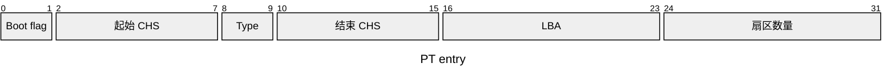

# 一、MBR分区与BIOS启动

全称 **Master Boot Record**

是 BIOS 时代的磁盘最开头的 512 字节区域（通常磁盘上的第 0 号扇区），既负责**启动**，又负责**分区管理**


🧩结构（总 512 B）：

- Boot code（446 B）
- Partition Table（64 B）：分区表，有 4 个表项
- Signature （2 B）（0x55 AA）


MBR 表项（entries）

- Boot flag
- 起始 CHS（3 B）
- 分区类型
- 结束 CHS（3 B）
- 起始 LBA（4 B）：决定了磁盘容量上限 2 TB
- 扇区数量（4 B）




# 二、GPT分区与UEFI启动


## GPT 分区

全称 **GUID Partition Table**，是现代磁盘分区标准，属于 **UEFI 规范的一部分**，用来替代 MBR。


结构：

- Protective MBR：第 0 扇区 LBA 0
- GPT Header：LBA 1
- Partition Entry Array（128个）
- Data
- Backup for Header & PTs


**Header 结构**

在 LBA 1，总共 96 B ，其余保留填充

| 偏移     | 大小   | 含义                              |
| -------- | ------ | --------------------------------- |
| 0x00     | 8B     | 签名 "EFI PART"                   |
| 0x08     | 4B     | 版本号                            |
| 0x0C     | 4B     | Header 大小                       |
| 0x10     | 4B     | Header CRC 校验                   |
| 0x14     | 4B     | 保留（必须为0）                   |
| 0x18     | 8B     | 当前 Header 所在 LBA              |
| 0x20     | 8B     | 备份 Header LBA                   |
| 0x28     | 8B     | 可用分区起始 LBA                  |
| 0x30     | 8B     | 可用分区结束 LBA                  |
| 0x38     | 16B    | 磁盘 GUID                         |
| 0x48     | 8B     | 分区表起始 LBA                    |
| **0x50** | **4B** | **分区表项数量（扩展分区关键⭐）** |
| 0x54     | 4B     | 单个分区项大小                    |
| 0x58     | 4B     | 分区表 CRC                        |
| 0x5C+    | 可变   | 保留填充                          |


**Partition Entry 格式**

总 128 B

|  Offset   |  Length  |                    Contents                     |
| :-------: | :------: | :---------------------------------------------: |
| 0 (0x00)  | 16 bytes |       Partition type GUID (little endian)       |
| 16 (0x10) | 16 bytes |      Unique partition GUID (little endian)      |
| 32 (0x20) | 8 bytes  |            First LBA (little endian)            |
| 40 (0x28) | 8 bytes  |        Last LBA (inclusive, usually odd)        |
| 48 (0x30) | 8 bytes  | Attribute flags (e.g. bit 60 denotes read-only) |
| 56 (0x38) | 72 bytes |    Partition name (36 UTF-16 LE code units)     |


常见分区类型：

- EFI System Part（ESP）：`C12A7328-F81F-11D2-BA4B-00A0C93EC93B`
- Linux filesystem（ext4）：`0FC63DAF-8483-4772-8E79-3D69D8477DE4`
- Linux swap：`0657FD6D-A4AB-43C4-84E5-0933C84B4F4F`
- BIOS Boot Partition（GRUB 用）：`21686148-6449-6E6F-744E-656564454649`
- Microsoft Basic Data（NTFS）
- Microsoft Reserved Partition
- Linux LVM
- Linux RAID


## UEFI 启动流程


```
上电/复位
   ↓
CPU reset vector
   ↓
UEFI 固件入口
   ↓
SEC 阶段（最早期）
   ↓
PEI 阶段（内存初始化）
   ↓
DXE 阶段（驱动 + 设备枚举）
   ↓
BDS 阶段（Boot Device Selection）
   ↓
Boot Manager（选择启动项）
   ↓
EFI Bootloader（如 grubx64.efi）
   ↓
操作系统内核（Linux kernel）
```


## GRUB 程序

⭐注意：grub 全称 **GRand Unified Bootloader**，是启动引导程序，介于 UEFI 与 Kernal 之间

(有时 UEFI 能直接启动 Kernal)

- 提供 Menu Entry
- 加载内核
  - 找到内核文件
  - 读取`initramfs`
  - 把它们加载到内存
- 设置 CPU 状态
- 传递启动参数
  - cmdline、initrd

- 跳转到内核入口


grub 程序位于 **EFI System Partion（ESP 分区）**

这个分区是 **FAT32 文件系统**

UUID：`C12A7328-F81F-11D2-BA4B-00A0C93EC93B`


grub 配置文件 `grub.cfg` 位置

```
# /boot/grub/grub.cfg
```


## 内核初始化流程

```start_kernel
start_kernel
  ↓
setup_arch（体系结构初始化）
  ↓
mm_init（内存管理）
  ↓
sched_init（调度器）
  ↓
trap_init / irq_init（中断）
  ↓
time_init（时钟）
  ↓
rest_init
  ↓
kernel_thread(kernel_init)
  ↓
init进程（PID 1）
```

```
GRUB
  ↓
start_kernel
  ↓
内存/调度/中断初始化
  ↓
rest_init
  ↓
kernel_init
  ↓
/sbin/init
  ↓
用户空间系统
```


内核 early，临时挂载`initramfs` （这个 FS 在内存中），`/init` 脚本在这里存储

（1）`rest_init`

- 创建 `kernel_init` 线程（最终启用用户空间）
- 创建 `kthreadd`（内核线程管理器，所有内核线程的父线程）
- CPU 进入调度循环

（2）`kernel_init`

- 驱动加载
- 挂载 `rootfs`
- 启动 `init`

（3）用户空间

第一个用户进程 PID=1，可能是 `systemd`，挂载真正 `rootfs`

- 启动服务
- 启动 shell
- 启动登录界面


`system.d` 负责

- 启动服务：ssh.service，network.service
- 管理进程树：
- 管理系统状态
