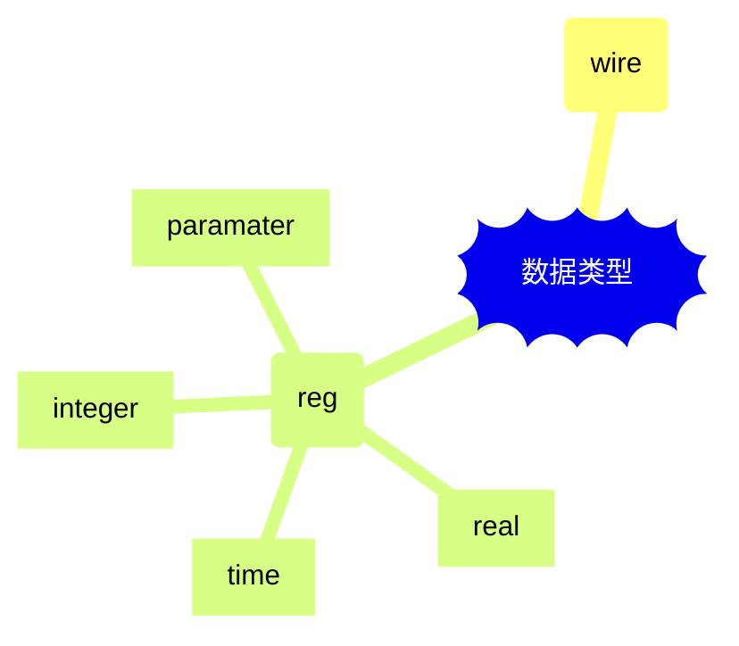
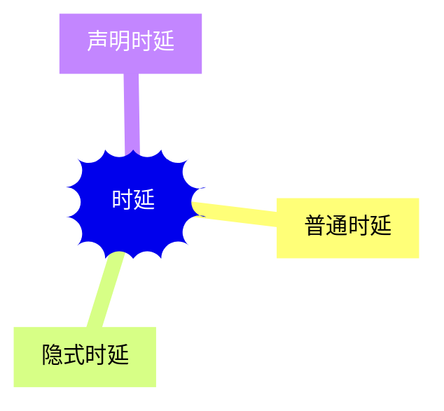

# 特性


## 三种建模方式

1. 行为级描述——使用过程化结构描述
2. 数据流描述——使用连续赋值语句建模
3. 结构化方式——使用门和模块例化语句描述


## 两大数据类型




1. 线网（wire）——物理元件之间的连线

2. 寄存器（reg）——数据存储元件 

   * integer

     > 声明时不用指明位宽，位宽和编译器有关，一般为32 bit。reg 型变量为无符号数，而 integer 型变量为有符号数。

   * real

     > 实数用关键字 real 来声明，可用十进制或科学计数法来表示。实数声明不能带有范围，默认值为 0。如果将一个实数赋值给一个整数，则只有实数的整数部分会赋值给整数。

   * time

     > Verilog 使用特殊的时间寄存器 time 型变量，对仿真时间进行保存。其宽度一般为 64 bit，通过调用系统函数 $time 获取当前仿真时间。

   * paramater

     > 常用于定义常数

   * 数组

   * 存储器
   
   * 字符串


Verilog 支持可变的向量域选择

**Verillog 还支持指定 bit 位后固定位宽的向量域选择访问。**

- **[bit+: width]** : 从起始 bit 位开始递增，位宽为 width。
- **[bit-: width]** : 从起始 bit 位开始递减，位宽为 width。


# 连续赋值

连续赋值语句是 Verilog 数据流建模的基本语句，用于对 wire 型变量进行赋值。：

格式如下

```verilog
assign     LHS_target = RHS_expression  ；
```

LHS（left hand side） 指赋值操作的左侧，RHS（right hand side）指赋值操作的右侧。

assign 为关键词，任何已经声明 wire 变量的连续赋值语句都是以 assign 开头，例如：

```verilog
wire      Cout, A, B ;
assign    Cout  = A & B ;     //实现计算A与B的功能
```

需要说明的是：

- LHS_target 必须是一个标量或者线型向量，而不能是寄存器类型。
- RHS_expression 的类型没有要求，可以是标量或线型或存器向量，也可以是函数调用。
- 只要 RHS_expression 表达式的操作数有事件发生（值的变化）时，RHS_expression 就会立刻重新计算，同时赋值给 LHS_target。

Verilog 还提供了另一种对 wire 型赋值的简单方法，即在 wire 型变量声明的时候同时对其赋值。wire 型变量只能被赋值一次，因此该种连续赋值方式也只能有一次。例如下面赋值方式和上面的赋值例子的赋值方式，效果都是一致的。

```verilog
wire      A, B ;
wire      Cout = A & B ;
```


# 过程赋值

过程性赋值是在 initial 或 always 语句块里的赋值，赋值对象是寄存器、整数、实数等类型。

这些变量在被赋值后，其值将保持不变，直到重新被赋予新值。

连续性赋值总是处于激活状态，任何操作数的改变都会影响表达式的结果；过程赋值只有在语句执行的时候，才会起作用。这是连续性赋值与过程性赋值的区别。

Verilog 过程赋值包括 2 种语句：阻塞赋值与非阻塞赋值。


# 时延

连续赋值时延一般可分为**普通赋值时延**、**隐式时延**、**声明时延**。




下面 3 个例子实现的功能是等效的，分别对应 3 种不同连续赋值时延的写法。

（1）普通时延，A&B计算结果延时10个时间单位赋值给Z
**wire** Z, A, B ;
**assign** #10   Z = A & B ;


（2）隐式时延，声明一个wire型变量时对其进行包含一定时延的连续赋值。
**wire** A, B;
**wire** #10     Z = A & B;

（3）声明时延，声明一个wire型变量是指定一个时延。因此对该变量所有的连续赋值都会被推迟到指定的时间。除非门级建模中，一般不推荐使用此类方法建模。
**wire** A, B;
**wire** #10 Z ;
**assign**      Z =A & B

## 惯性时延

在上述例子中，A 或 B 任意一个变量发生变化，那么在 Z 得到新的值之前，会有 10 个时间单位的时延。如果在这 10 个时间单位内，即在 Z 获取新的值之前，A 或 B 任意一个值又发生了变化，那么计算 Z 的新值时会取 A 或 B 当前的新值。所以称之为惯性时延，即信号脉冲宽度小于时延时，对输出没有影响。


# 过程结构


（1）initial 语句

initial 语句从 0 时刻开始执行，只执行一次，多个 initial 块之间是相互独立的。

如果 initial 块内包含多个语句，需要使用关键字 begin 和 end 组成一个块语句。

如果 initial 块内只要一条语句，关键字 begin 和 end 可使用也可不使用。

initial 理论上来讲是不可综合的，多用于初始化、信号检测等。

（2）always 语句

与 initial 语句相反，always 语句是重复执行的。always 语句块从 0 时刻开始执行其中的行为语句；当执行完最后一条语句后，便再次执行语句块中的第一条语句，如此循环反复。

由于循环执行的特点，always 语句多用于仿真时钟的产生，信号行为的检测等。


# 基础语法


## 条件分支


## 循环


# 状态机

也称有限状态机（FSM）

能记住系统的历史输入，根据当前输入与历史输入产生一个新的值

CPU本质上是一个大的状态机


有两种类型的状态机

- Moore型：输出只和当前状态有关
- Mealy型：输出与当前输入、当前状态有关；容易产生毛刺


工程上有三种写法：

- 一段式：不分现态和次态；只由一个时序块（always块）完成

- 二段式：分现态和次态；由两个逻辑块组成：状态寄存器更新（时序逻辑）+ 状态转移并产生输出（组合逻辑）

- 三段式

  > 由三个逻辑部分组成：状态寄存器更新（时序逻辑）+ 状态转移（组合逻辑）+ 输出（时序逻辑or组合逻辑）


什么是毛刺（glitch）？

在组合逻辑电路中，由于逻辑路径延迟不同，导致输出出现短暂错误跳变。这就是毛刺

例如：

```verilog
assign Y = (A & B)|(~A & C)
```

假设B=C=1，那么逻辑上Y=1的结果是必然的。但是实际电路中，A与~A的逻辑路径延迟是不同的，可能出现A=0和 ~A=0的错误组合，Y的结果可能跳变到0。

**归根结底**：当组合逻辑Y的驱动输入变化时，Y值就立即变化，它可能出现不稳定状态。（出现毛刺）

**解决办法**：如果将Y写成寄存器，它会等待时钟边沿再去更新。（拦住了毛刺）


Moore型状态机由于输出只依赖于状态，状态由寄存器存储，只会在时钟边沿变化，所以更稳定。


# 锁存器

什么是锁存器（Latch）？锁存器不同于边沿触发的触发器，它是**电平触发**的。

当电平有效时，它会立即将输入变化的输出；当电平无效时，记住上一次的值。

当组合逻辑输出没有覆盖完整时，EDA工具会给你综合出一个Latch（默认保持上一次的值），显然组合逻辑不应有记忆功能，这不是我们所期望的。


# 按键防抖

机器开关，如轻触按键，是由压力作用下的金属产生弹性形变，控制电路的连通。在按下和松手的过程中，会产生金属抖动，导致接触不稳定，从而信号不稳定。


在verilog中，可用状态机实现一个防抖模块。将一次抖动的按键输入信号，转化成单时钟的脉冲信号（本质上是一个事件驱动的脉冲信号）。

状态定义：

- IDLE
- P_FILTER
- PRESSED
- R_FILTER


一段式写法状态机实现按键消抖，输出表示一次”按下“事件的单时钟周期脉冲信号`key_p_flag`

```verilog
always @(posedge clk or negedge rst_n) begin
    if(!rst_n) begin			//状态与脉冲信号复位
        state <= IDLE;
        key_p_flag <= 0;
    end   
    else
        case(state)
            IDLE:
                if(neg_flag) //按下事件开始的边沿脉冲；一般按键输入管脚都是接上拉电阻，低电平有效
                    state <= P_FILTER;
            
            P_FILTER: begin
                if(delay_reached)//计数到抖动发生的平均延迟时间，并且没有抖动发生，说明信号已经稳定
                    state <= PRESSED;
                	key_p_flag <= 1;//稳定后，表明按下事件已经稳定，可发射脉冲
                else if (pos_flag)//未计数到平均时间，并且发生了抖动，表明抖动正在发生，回退到上一状态
                	state <= IDLE;
                else
                    state <= P_FILTER;//未计数到平均时间，没发生抖动，表明信号可能已经稳定，继续保持状态，继续计数
           	end
            
            PRESSED:begin
                key_p_flag <= 0;//在下一个时钟周期到来后，就赋0，形成脉冲闭环，这个脉冲信号就占单个时钟周期
                if(pos_flag)//松开事件边沿信号发生
                    state <= R_FILTER;
            end
            
            R_FILTER: begin
                if(delay_reached)//到达稳定计时阈值，表明信号已经稳定
                    state <= IDLE;
                else if (neg_flag)//发生抖动
                	state <= PRESSED;
                else
                    state <= R_FILTER;//稳定，并计时中
            end
        endcase
    
end
```

三个辅助信号

- `delay_reached`：计数检测信号
- `pos_flag`：上升沿检测信号
- `neg_flag`：下降沿检测信号

两级同步防亚稳态

```verilog
always @(posedge clk) begin
    key_sync0 <= key_in;
	key_sync1 <= key_sync0;
end
```

边沿检测

```verilog
always @(posedge clk) begin
    key_state <= key_sync1;

    pos_flag <= key_sync1 & ~key_state;
	neg_flag <= ~key_sync1 & key_state;
end
```

抖动平均时延计数

```verilog
assign delay_reached = ( cnt >= CNT_MAX-1 );
```


# 触发器

是基本时序逻辑单元，能够记忆上一拍的数据信息。

一般的组合逻辑电路只有计算能力，而触发器能记住保存1bit的信息


什么是锁存器（Latch）?

Latch 是**电平触发**的存储器，例如SR锁存器，特性是在电平有效时，输出会随着输入改变


Flip-Flop 是由**边沿触发**，例如D触发器，只会在**边沿**进行锁存，其他时间都保持数据


D触发器的构成：

D触发器可由2个**时钟反向**的D锁存器串联而成，一个是主锁存器，另一个是从锁存器。


D触发器是如何实现边沿触发的？

第一个上升沿到来：主锁存器连通，从锁存器锁存---->主锁存器锁存，从锁存器连通

第一个下降沿到来：主锁存器锁存，从锁存器连通---->主锁存器连通，从锁存器锁存；

这个时钟周期内：主锁存器连通，从锁存器锁存---->主锁存器锁存，从锁存器连通---->主锁存器锁存，从锁存器连通

结果：下降沿时，无论输入变化，输出会保持上升沿时锁存的值

对比单个D锁存器：边沿锁存，下个边沿又会导通，数据锁存不到一个周期的时间


# 建立时间与保持时间

几个时间概念：

（1）$T_{co}$ 也称 Clk-to-Q delay

> 触发器在时钟有效沿到来之后，输出Q端经过多久才能稳定改变


（2）$T_{skew}$也称时钟扭斜（Clock Skew） 

> 同一时钟到达系统中不同寄存器的时间偏差


Hold Violation


Setup Violation


建立时间的时序约束


保持时间的时序约束


什么是建立时间$T_{setup}$？

D触发器是由一个主锁存器和一个从锁存器构成的，

新值信号必须在主锁存器时钟信号到达之前，传输到主锁存器的双稳态输出电路部分，新值才能有效锁存

建立时间=等于输入端口到达双稳态电路这段路径的延迟


什么是保持时间$T_{hold}$？

在主锁存器时钟信号到达之后，数据跳变信号未到达双稳态输出电路内部，跳变的值无法被锁住

保持时间=主锁存器锁存信号到达延迟时间 - 输入端口到双稳态输出电路入口路径的延迟时间


数据能被成功采样的等价命题：

- 数据要比时钟提前到达数据端口
- 数据路径（data path）要比时钟路径（clock path）更快
- 数据到达时间（data arrival time）小于数据需要时间（data require time）

本质：新数据要经过组合逻辑路径的延迟时间，才能传送到数据端口，如果能提前这部分延迟准备好新数据，确保能在时钟到达前，先一步到达数据端口，怎能锁存


竞争与冒险

（1）竞争（Race）

> 电路中，信号的传播存在传输延迟，不同输入的数据路径不同，所以到达输出端口的时间也不同，此时输出容易短暂的错误状态（毛刺）

（2）冒险（Hazard）

> 由于毛刺的出现，存在被错误采样的风险


D触发器的内部结构：
