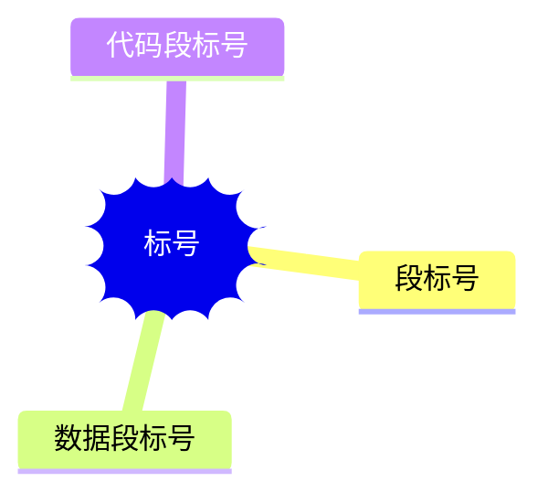

# 组成部分

1. 汇编指令

   对应机器码，机器码助记符
2. 伪指令

   无机器码，由编译器执行
3. 其他符号

   如 +、-、*、/，无机器码，由编译器识别

# 内存地址空间

| 地址          | 描述        | 大小    |
| ----------- | --------- | ----- |
| 00000-9FFFF | 主存地址空间    | 640KB |
| A0000-BFFFF | 显存地址空间    | 128KB |
| C0000-FFFFF | 各类 ROM 空间 | 256KB |

总：2^20B=1MB

# 寄存器

14个寄存器，寄存器16位

| 分类    | 寄存器 | 全称                  | 描述   |
| ----- | --- | ------------------- | ---- |
| 主寄存器  | AX  | Accumulator         | 累加器  |
|       | BX  | Base                | 基址   |
|       | CX  | Count               | 计数   |
|       | DX  | Data                | 数据   |
| 变址寄存器 | SI  | Source Index        | 源变址  |
|       | DI  | Destination Index   | 目的变址 |
|       | SP  | Stack Pointer       | 堆栈指针 |
|       | BP  | Base Pointer        | 基址指针 |
| 程序计数器 | IP  | Instruction Pointer | 指令指针 |
| 段寄存器  | CS  | Code Segment        | 代码段  |
|       | SS  | Stack Segment       | 堆栈段  |
|       | DS  | Data Segment        | 数据段  |
|       | ES  | Extra Segment       | 附加段  |
| 状态寄存器 | PSW |                     | 标志   |

# 标志寄存器

也叫 PSW 程序状态字

| 寄存器 | 描述           | 1标志    | 0标志     | 位序  |
| --- | ------------ | ------ | ------- | --- |
| CF  | 进位标志（无符号数运算） | CY     | NC      | 0   |
| PF  | 奇偶标志         | PE     | PO      | 2   |
| AF  | 辅助标志         | AC     | NA      | 4   |
| ZF  | 零标志          | ZR     | NZ      | 6   |
| SF  | 符号标志（有符号数运算） | NG     | PL      | 7   |
| TF  | 跟踪标志         | 单步中断   | 关       | 8   |
| IF  | 中断标志         | EI，可中断 | NI，屏蔽中断 | 9   |
| DF  | 方向标志         | DN     | UP      | 10  |
| OF  | 溢出标志（有符号数运算） | OV     | NV      | 11  |

# 给出物理地址的方法

问题：8086 PC 机，字长16位，CPU 一次性能处理的数据最宽16位，寄存器只有16位，但地址线有20位

解决方法：物理地址=段地址x16+偏移地址

# 加电启动和复位

8086 CPU 加电启动或复位后，CS=FFFFH，IP=0000H

所以 8086 CPU 第一条指令是 FFFF0H

# MOV 指令

可完成以下9种操作

| 目的    | 源     |
| ----- | ----- |
| 通用寄存器 | 通用寄存器 |
|       | 段寄存器  |
|       | 内存    |
|       | 立即数   |
| 段寄存器  | 通用寄存器 |
|       | 内存    |
| 内存    | 通用寄存器 |
|       | 段寄存器  |
|       | 立即数   |

# 修改 CS:IP

8086 CPU 无法通过 **传送指令** 修改 CS:IP

可以通过 **转移指令** 修改

# DX 与 \[address]

8086 CPU 不支持将数据直接传送入段寄存器，必须用寄存器中转。

# 栈机制

8086 CPU 提供 push 和 pop 指令，实际上为内存传送指令

| 指令   | 操作对象     |
| ---- | -------- |
| push | 寄存器|内存单元 |
| pop  | 寄存器|内存单元 |

提供 SS 和 SP 寄存器作为，栈段和栈指针。

push ax 实现过程：

1. SP=SP-2，SS:SP 指向当前栈顶元素的前一个元素，以当前栈顶前面的单元作为新栈顶
2. 将 ax 的内容送入 SS:SP 指向的内存单元处，SS:SP 此时指向新栈顶

栈顶超界问题：8086 CPU 未提供栈上下界寄存器，只记录栈顶，栈空间大小由我们自己管理。

# 汇编器对指令中 \[idata] 解析

在汇编源程序中，如果指令中出现 \[idata] 必须显示指出段寄存器（段前缀），才能表示内存单元，否则会被解析为立即数

如：

```assembly
mov ax,[idata]
```

等同于

```assembly
mov ax,idata
```

显示指出段寄存器，表示内存单元

```assembly
mov ax,ds:[idata]
```

\[bx] 不用显示指出段寄存器，表示内存单元

```assembly
mov ax,[bx]
```

而在Debug 中，指令中 \[idata] 会被解析成内存单元

```assembly
mov ax,[idata]
```

# 一段安全的空间

`0:200~0:2ff` 这段空间一般不会被系统和其他合法程序的使用

# 源程序中的标号处理



（1）mov 指令对标号（无论是数据标号，还是代码段标号）的直接引用的含义是，取标号表示的内存单元的值，而不是标号代表的偏移地址值

下面两条指令等同，段地址默认为 数据标号（变量）所对应的数据段

```assembly
mov ax,var1
mov ax,[var1]
```

通过 offset 和 seg 能分别取到标号的 偏移地址和段地址。

（2）mov 指令对段标号的直接引用的含义是，取段标号所代表的段地址

（3）转移指令 对代码段标号的直接引用的含义是，取代码段标号表示的偏移地址

# 灵活的定位内存地址方法

## 1. \[bx+idata]

也可以写成

```assembly
mov ax,idata[bx]
```

## 2. SI 和 DI

SI 和 DI 是 8086 CPU 中，功能与 bx 差不多的寄存器，但 SI 和 DI 不能拆分为两个8位的寄存器使用

```assembly
mov ax,[di+idata]
mov ax,idata[si]
mov ax,[bx+idata]
```

## 3. \[bx+si] 和 \[bx+di]

\[bx+si] 与 \[bx+di] 功能类似

```assembly
mov ax,[bx+si]
```

可以写成

```assembly
mov ax,[bx][si]
```

## 4. \[bx+si+idata] 和 \[bx+di+idata]

\[bx+si+idata] 与 \[bx+di+idata] 功能类似

下例代码每句功能相同

```assembly
mov ax, [bx+si+200]
mov ax,	[200+bx+si]
mov ax,	200[bx][si]
mov ax,	[bx].200[si]
mov ax,	[bx][si].200
```

## 5. BP

只要在 \[...] 使用 **BP**，若段地址没有显示给出，默认段地址都在 **SS** 中

# 寻址方式

## 面向操作数的

### 立即数寻址

## 面向寄存器寻址

### 寄存器寻址

操作数在某个寄存器中

## 面向内存的寻址

### 1. 直接寻址

| 寻址方式     | 含义                |     |
| -------- | ----------------- | --- |
| \[idata] | EA=idata，SA=\[ds] |     |

### 2. 寄存器间接寻址

| 寻执方式  | 含义                |
| ----- | ----------------- |
| \[bx] | EA=\[bx]，SA=\[ds] |
| \[si] | EA=\[si]，SA=\[ds] |
| \[di] | EA=\[di]，SA=\[ds] |
| \[bp] | EA=\[bp]，SA=\[ds] |

### 3. 寄存器相对寻址（基址寻址、间址寻址）

| 寻执方式        | 含义                      |
| ----------- | ----------------------- |
| \[bx+idata] | EA=\[bx]+idata，SA=\[ds] |
| \[si+idata] | EA=\[si]+idata，SA=\[ds] |
| \[di+idata] | EA=\[di]+idata，SA=\[ds] |
| \[bp+idata] | EA=\[bp]+idata，SA=\[ds] |

### 4. 基址变址寻址

| 寻执方式     | 含义                      |
| -------- | ----------------------- |
| \[bx+si] | EA=\[bx]+\[si]，SA=\[ds] |
| \[bx+di] | EA=\[bx]+\[di]，SA=\[ds] |
| \[bp+si] | EA=\[bp]+\[si]，SA=\[ds] |
| \[bp+di] | EA=\[bp]+\[di]，SA=\[ds] |

### 5. 相对基址变址寻址

| 寻执方式           | 含义                            |
| -------------- | ----------------------------- |
| \[bx+si+idata] | EA=\[bx]+\[si]+idata，SA=\[ds] |
| \[bx+di+idata] | EA=\[bx]+\[di]+idata，SA=\[ds] |
| \[bp+si+idata] | EA=\[bp]+\[si]+idata，SA=\[ds] |
| \[bp+di+idata] | EA=\[bp]+\[di]+idata，SA=\[ds] |

# 指令处理的数据有多长

## 1. 寄存器指明

```assembly
mov ax,bx
```

## 2. X ptr 指明

（1）word 指明操作数是字类型

```assembly
mov word ptr [bx],[si]
```

（2）byte 指明操作数是字节类型

```assembly
mov byte ptr [bx],[si]
```

## 3. 其他指明

push 指令只进行字操作

```assembly
push [bx]
```

# 算术运算

## 除法

```assembly
div [reg|mem]
```

支持 8位、16位除法

* 除数：8位或16位，在一个 reg 或内存单元中
* 被除数：若除数 8位，则被除数 16 位，默认存放在 AX中；若除数为 16 位，则被除数 32位，AX 存低位，DX 存高位
* 结果：若除数为 8位，AL 存结果，AH 存余数；除数为 16位，AX 存结果，DX 存余数。

| 除数  | 被除数       | 结果  | 余数  |
| --- | --------- | --- | --- |
| 8位  | AX        | AL  | AH  |
| 16位 | 低位AX，高位DX | AX  | DX  |

## 乘法

```assembly
mul [reg|内存单元]
```

| 乘数位数 | 乘数位置                          | 结果          |
| ---- | ----------------------------- | ----------- |
| 8 位  | 一个默认在 AL，另一个可以在 8位 reg，或者内存中  | AX          |
| 16 位 | 一个默认在 AX，另一个可以在 16位 reg，或者内存中 | 低位 AX，高位 DX |

# 转移指令原理

## 分类

### 1、根据转移行为不同

* 段内转移：只修改 IP，如 `jmp ax`
* 段间转移：同时修改 CS:IP，如`jmp 1000:0`

### 2、根据指令对 IP 修改范围不同

* 短转移：IP 修改范围为 -128～127
* 近转移：IP 修改范围为 -32768～32767 

### 3、80806 CPU 转移指令

* 无条件转移指令（jmp）
* 条件转移指令

  > 所有条件转移指令，都是短转移
* 循环指令（loop）

  > 所有的循环指令，都是短转移
* 过程
* 中断

## 操作符 offset

由编译器处理

功能：取得标号处的偏移地址

## 依据位移进行转移的 jmp 指令

### jmp short \[标号]

实现功能：(IP)=(IP)+8位位移

汇编器在进行汇编时，根据汇编中的标号计算出来，并用补码表示

### jmp neart ptr \[标号]

实现段内近转移

实现功能：(IP)=(IP)+16位位移

## 转移目的地址在指令中的 jmp 指令

段间转移，又称远转移：

```assembly
jmp far ptr 标号
```

## 转移地址在寄存器中的 jmp 指令

用某一合法寄存器的值修改 IP 的值

```assembly
jmp reg
```

## 转移地址在内存中的 jmp 指令

段内转移：

```assembly
jmp word ptr [内存单元]
```

段间转移：

```assembly
jmp dword ptr [内存单元]
```

## jcxz 指令

所有条件转移，都是短转移

```assembly
jcxz [标号]
```

当 CX=0 时，跳转到标号处，位移由编译器在编译时算出，并由补码表示。

# CALL 和 RET

## ret

功能：近转移返回

相当于：

```assembly
POP IP
```

## retf

功能：远转移返回

相当于：

```assembly
POP IP
POP CS
```

## 依据位移进行转移的 call 指令

call指令不实现短转移，下面指令为近转移：

```assembly
call 标号
```

## 转移地址在指令中的 call 指令

```assembly
call far ptr 标号
```

## 转移地址在寄存器中的 call 指令

```assembly
call reg
```

## 转移地址在内存中的 call指令

### 近转移

```assembly
call word ptr [内存地址单元]
```

### 远转移

```assembly
call dword ptr [内存地址单元]
```

# PC 机键盘处理过程

## 端口

相关端口：60h

## 扫描码

通码第7位为0，断码第7位为1，所以：

断码=通码+80h

## 9号中断例程

9号中断例程是由BIOS提供，功能是将端口传来的扫描码，判断对应的 ascii 码，一起存入 BIOS 键盘缓冲区

内存中设置有BIOS键盘缓冲区，可以存储15个键盘输入，低位字节：字符码，高位字节：扫描码

内存单元 0040:17 存储键盘状态信息

| 位   | 状态         |
| --- | ---------- |
| 0   | 右Shift     |
| 1   | 左Shift     |
| 2   | Ctrl       |
| 3   | Alt        |
| 4   | ScrollLock |
| 5   | NumLock    |
| 6   | CapsLock   |
| 7   | Insert     |

## 16h中断例程

### 0号子程序

功能：从BIOS键盘缓冲区读出一个字符，并将其从缓冲区删除。如果缓冲区没有数据，则继续循环检测。

结果：

1. ah：扫描码
2. al：ASCII 码

# 端口读写

8086 CPU 可寻址 65536 个端口

只能用 al 存8位数据，ax 存16位数据

访问 256-65535 端口，用 dx 寄存器存端口号

读：从 71h 端口读数据

```assembly
in al,71h
```

写：向 71h 端口写数据

```assembly
out 71h,al
```

# 显示缓冲区

内存地址 `B8000H-BFFFFH` 的`32KB`空间为 8086CPU 80X25 彩色字符模式的显示缓冲区

共8页，每页2000个字符，4000B

每个字符，低字节为显示字符的 `ASCII 码`，高字节为字符的`颜色属性`

颜色属性：

| 位数  | 描述  |
| --- | --- |
| 7   | 闪烁位 |
| 6   | 背景R |
| 5   | 背景G |
| 4   | 背景B |
| 3   | 高亮  |
| 2   | 前景R |
| 1   | 前景G |
| 0   | 前景B |

# 中断机制

## 中断向量表

8086 CPU 默认 

0000:000-0000:03FF 存放中断向量表，高地址字存放 `段地址`，低地址字存放 `偏移地址`

实际上 0000:0200-0000:02FF 为空

除法溢出中断是0号

## 中断过程

当产生中断信号时，硬件执行一系列过程，最后将 CS:IP 指向中断处理程序。这个过程叫中断过程

1. 从中断信息获取中断类型码---n
2. PSW 入栈
3. TF、IF 置0
4. CS 入栈
5. IP 入栈
6. IP=(n\*4)，CS=(n\*4+2)

这个过程由硬件完成，程序员不可改变

## BIOS 中断例程

### int 10h

#### 2号子程序

功能：设置光标

参数：

1. bh：页号
2. dh：行号
3. dl：列号

#### 9号子程序

功能：在光标处设置字符

参数：

1. al：传入的字符
2. bl：颜色属性
3. bh：页号
4. cx：字符重复个数

### int 13h

## DOS 中断例程

### int 21h

#### 4c号子程序

功能：返回dos

参数：

1. al：返回值

#### 9号子程序

功能：在光标处显示字符串

参数

1. ds:dx：指向要显示的字符串

#### 0AH

## 内中断

## 外中断

### 1. 可屏蔽中断

### 2. 不可屏蔽中断

# 参数传递

## 寄存器冲突

由于无法知道子程序所用寄存器，是否在别的地方被使用

应当在进入子程序后，将所用寄存器压栈保存，离开前，弹栈恢复

例：

```assembly
proc:	
		push bx
		
		mov bx,3
		inc bx
		
		pop bx
		ret
```

## 首地址传参（批量传参）

## 用栈传参

将需要传递的数据，在调用子程序之前，压栈，然后获取栈针`bp=sp`进行访问。

进入子程序之后，当前栈顶为 IP，后面依次为传递的参数数据

离开子程序后，使用 

```assembly
ret X
```

弹栈删除

例如

```assembly
;实现 (a-b)*3
;ret 4 表示 (1)pop ip(2)add sp,4
difcube:
		push bp
		mov bp,sp
		mov ax,[bp+4]
		sub ax,[bp+6]
		mov bp,ax
		mul bp
		mul bp
		pop bp
		ret 4
```

# 指令目录

## 算术运算

| 指令  | 含义               | 功能                   | DST    |
| --- | ---------------- | -------------------- | ------ |
| add | 加法               | (DST)=(DST)+(SRC)    | 内存|寄存器 |
| adc | 进位加法             | (DST)=(DST)+(SRC)+CF | 内存|寄存器 |
| inc | +1               | (DST)=(DST)+1        | 内存|寄存器 |
| sub | 减法               | (DST)=(DST)-(SRC)    |        |
| sbb | 借位减法             | (DST)=(DST)-(SRC)-1  |        |
| dec | \-1              | (DST)=(DST)-1        |        |
| neg | 求反               |                      |        |
| cmp | 比较，两数相减，只影响标志寄存器 |                      |        |
|     |                  |                      |        |

## 逻辑运算

## 串指令

| 指令    | 功能                                                           | 描述         |
| ----- | ------------------------------------------------------------ | ---------- |
| movsb | ((ES)\*16+DI)=((DS)\*16+SI)；IF DF=0，DI++，SI++，ELSE DI--，SI-- | 内存到内存的字节复制 |
| movsw |                                                              | 内存到内存的字复制  |
| rep   | 根据 CX，重复执行后面的串指令                                             |            |
| cld   | DF=0，UP                                                      |            |
| std   | DF=1，DN                                                      |            |
|       |                                                              |            |

## 程序转移指令

通常和 cmp 配合使用

| 分类   | 指令      | 含义       | 检测标志        |
| ---- | ------- | -------- | ----------- |
| 无符号数 | JA      | 大于       | CF=0 且 ZF=0 |
|      | JNA，JBE | 不大于，小于等于 | CF=1 或 ZF=1 |
|      | JB      | 低于       | CF=1 且 ZF=0 |
|      | JNB，JAE | 不低于，大于等于 | CF=0 或 ZF=1 |
| 有符号数 | JG      | 大于       |             |
|      | JNG，JLE | 不大于，小于等于 |             |
|      | JL      | 小于       |             |
|      | JNL，JGE | 不小于，大于等于 |             |
| 其他   | JZ，JE   | 等于0      | ZF=1        |
|      | JNZ，JNE | 不等于0     | ZF=0        |
|      | JC      | 有进位      | CY          |
|      | JNC     | 无进位      | NC          |
|      | JO      | 有溢出      |             |
|      | JNO     | 无溢出      |             |
|      | JP，JPE  | 为偶       |             |
|      | JNP，JPO | 为奇       |             |

# 中断汇总表

| 分类     | 中断例程 | 描述          |     |
| ------ | ---- | ----------- | --- |
| BIOS中断 | 10h  | 显示服务        |     |
|        | 13h  | 直接磁盘服务      |     |
|        | 14h  | 串行口服务       |     |
|        | 15h  | 杂项系统服务      |     |
|        | 16h  | 键盘服务        |     |
|        | 17h  | 并行口服务       |     |
|        | 1Ah  | 时钟服务        |     |
| DOS中断  | 20h  | 终止程序运行      |     |
|        | 21h  | DOS功能调用     |     |
|        | 22h  | 终止处理程序的地址   |     |
|        | 23h  | Ctrl+C 处理程序 |     |
|        | 24h  | 致命错误处理程序    |     |
|        | 25h  | 读磁盘扇区       |     |
|        | 26h  | 写磁盘扇区       |     |
|        | 27h  | 终止，并驻留内存    |     |
|        | 28h  | DOS空闲       |     |
|        | 2Fh  | 多重中断服务      |     |
|        | 33h  | 鼠标功能        |     |

## int 10h 显示服务

| ah（功能号） | 描述             | 参数  |
| ------- | -------------- | --- |
| 00h     | 设置显示器模式        |     |
| 01h     | 设置光标形状         |     |
| 02h     | 设置光标位置         |     |
| 03h     | 读取光标位置         |     |
| 04h     |                |     |
| 05h     | 设置显示页          |     |
| 06h     | 初始化            |     |
| 07h     | 滚屏             |     |
| 08h     | 读取光标处的字符及其属性   |     |
| 09h     | 在光标处，按指定属性显示字符 |     |
| 0Ah     | 在当前光标处显示字符     |     |
| 0Bh     | 设置调色板、背景色、边框   |     |
| 0Ch     | 写图形像素          |     |
| 0Dh     | 读图形像素          |     |
| 0Eh     |                |     |
| 0Fh     | 读显示器模式         |     |
| 10h     | 颜色             |     |
| 11h     | 字体             |     |
| 12h     | 显示器的配置         |     |

# Debug

| 指令  | 描述                   | 格式                          |
| --- | -------------------- | --------------------------- |
| R   | 查看、改变CPU寄存器的内容       |                             |
| D   | 查看内存 中的内容            | \-d 段地址 : 起始偏移地址  \[末尾偏移地址] |
| E   | 改写内存中的内容             |                             |
| U   | 将内存中的机器指令编译成汇编指令     |                             |
| T   | 执行一条机器指令             |                             |
| A   | 以汇编指令的格式在内存中写入一条机器指令 |                             |
| Q   | 退出                   |                             |

# NASM VS MASM

Netwide Assembler，是一款开源且免费的汇编器，与MASM 都是 Intel 汇编风格

（1）标号即汇编地址

在编译时，所有的标号都会被换为汇编地址，是一个立即数

如果要取得该地址处的值，必须是用 \[tag]

```assembly
mov ax,tag		立即数寻址
mov ax,[tag]	直接寻址
```

（2）不需要 seg，offset

因为标号即地址，立即数

（3）没有 dup ，取而代之的是 times

```assembly
times 128 db 1		定义128个字节1
```

（4）多了一个伪指令 dq

```assembly
dq 1		定义一个4字变量
```
