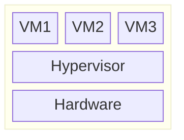
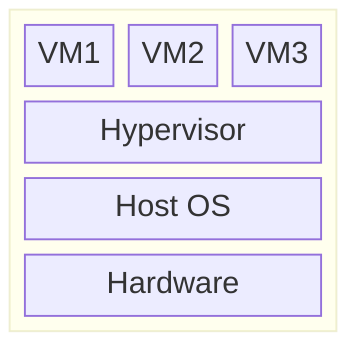

 

虚拟化技术：计算机资源的重新分配

# 一、概念

## 定义

在计算机技术中，**虚拟化**（技术）或**虚拟技术**（Virtualization）是一种**资源管理技术**，是将计算机的各种实体资源，予以抽象、转换后呈现出来并可供分割、组合为一个或多个电脑配置环境。

传统的虚拟技术：虚拟机（VMs）: 

有两个对象：

1. Hypervisor：用来创建、运行、管理虚拟机
2. VM（Virtual Machine）

## Hypervisor

补充两个概念

1. Host Machine：通常指的是虚拟化平台，如果是 type 2 Hypervisor，则会有一个 Host OS
2. Guest Machine：通常指的是在虚拟化平台（Hypervisor）上运行的虚拟机（Linux VM）

Type1 架构图

Type2 架构图

# 二、历史

虚拟技术起源于20世界60年代末，美国IBM公司当时开发了一套被称作虚拟机监视器 **VMM**（Virtual Machine Monitor）的软件，该软件作为计算机硬件层上面的一层软件抽象层，将计算机硬件虚拟分割成一个或多个虚拟机，并提供多用户对大型计算机的同时、交互访问。

有关容器化（Containerization or OS Level Virtualization）的历史：

> 2008 年 Linux 内核引进了 cgroups （control-groups）, " paved the way for all the different container technologies we see today "

# 三、分类

## 按照抽象程度分类（递增）

- 硬件抽象层等级的虚拟化（Hardware Abstruction Level）：VMware ESXi、Hyper-V

  > 这个等级的虚拟化靠Hypervisor，运行平台的叫 Host Machine，平台上运行的叫 Guest Machine
  >
  > type 1 hypervisor ，不经操作系统，直接运行在硬件上；type 2 hypervisor 运行在操作系统上

- 指令集架构等级的虚拟化（Instruction Set Architecture Level）：Bochs、QEMU

- 操作系统等级的虚拟化或**容器化**（Operating System Level or Containerization）：Docker、LXC

  > 将操作系统内核虚拟化，这个等级的虚拟机共享实体主机的硬件以及操作系统，呈现彼此独立且隔离的虚拟机环境。
  >
  > 补充概念：应用软件的环境是由操作系统、函数库、相依性软件、特定的文件系统以及其他环境设置所组成。

- 编程语言等级的虚拟化（Programming Language Level）：Java、.NET

  > 将高级语言转换成字节码，通过虚拟机转译成可以直接执行的指令

- 函数库等级的虚拟化（Library Level）：Wine、WSL

## 按虚拟对象分类

- 硬件虚拟化

- 虚拟机

  - 平台虚拟化
    - 完全虚拟化：敏感指令在操作系统和硬件之间被捕捉处理，客户操作系统无需更改，所有软件都能在虚拟机中运行。
    - 硬件辅助虚拟化：利用硬件（主要是CPU）辅助处理敏感指令，以实现完全虚拟化的功能。如 KVM, Hyper-V
    - 部分虚拟化
    - 准虚拟化
    - 操作系统级虚拟化：使操作系统内核支持多用户空间实例。如 LXC, chroot
  - 应用程序虚拟化

- 虚拟内存

- 存储虚拟化

- 网络虚拟化

QEMU的架构

> QEMU（Quick Emulator）和 Bochs 类似
>
> QEMU的架构由纯软件实现，并在Guest与Host中间，来处理Guest的硬件请求，并由其转译给真正的硬件。
>
> 然而因为QEMU是纯软件实现的，所有的指令都要经过QEMU，使得性能很差，而配合KVM则可以解决这一问题。
>
> QEMU虚拟化的思路是：提取Guest代码，翻译为**TCG**中间代码，而后翻译为**Host**代码。相当于实现了一个“中间人”的角色。

# 四、虚拟技术的发展

下面是云服务厂商虚拟化技术的一个迭代。基本上都是基于硬件虚拟化

（1）VMware-ESXi

是一个 type-1 Hypervisor，直接运行在硬件上

（2）Xen

是一个 type-1 Hypervisor，直接运行在硬件上

（3）KVM（Kernal Based Virtual Machine）

是一个 type-2 Hypervisor，依赖于操作系统（Linux内核）来管理虚拟化，本身是一个**内核模块**，基于硬件虚拟化来虚拟化功能。

将 Linux 内核转化为 Hypervisor。

KVM被合并入Linux内核版本2.6.20的主流分支，于2007年2月5日发布。

